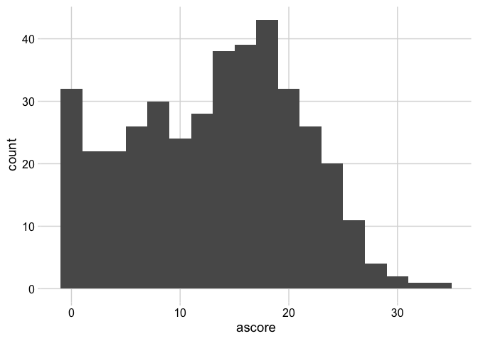
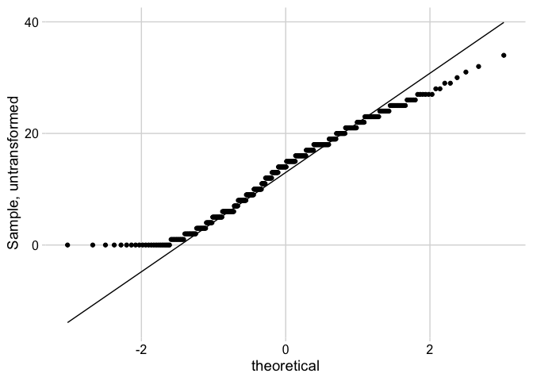
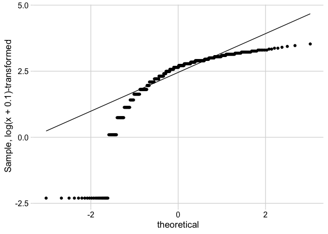
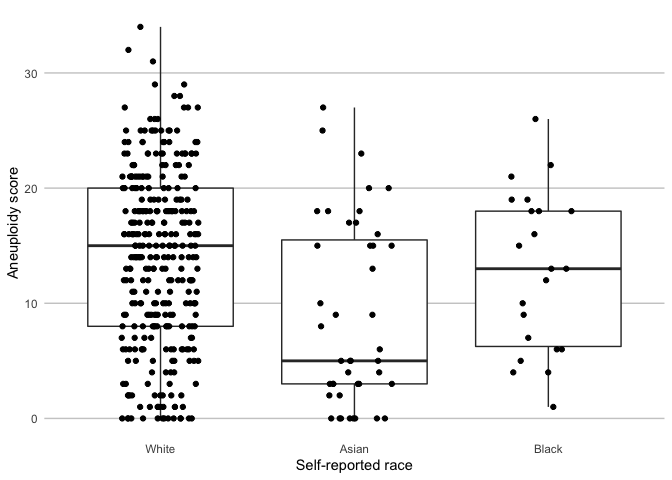

<!-- README.md is generated from README.Rmd. Please edit that file -->

# The `khsmisc` package

<!-- badges: start -->

<!-- badges: end -->

The `khsmisc` package serves two purposes: (a) loading a set of core
packages for epidemiology research and (b) providing a set of custom
functions, which also build on the core packages.

## Installation

The `khsmisc` package can be installed from
[GitHub](https://github.com/stopsack/khsmisc). A CRAN submission is not
planned.

``` r
# if "remotes" library is missing, install it first:
#   install.packages("remotes")
library(remotes)
remotes::install_github("stopsack/khsmisc")
```

## Loaded Core Packages

When loading `library(khsmisc)`, by design, the following dependencies
will be made available:

  - **Data handling:** the whole universe of the `tidyverse`; variable
    labels via `labelled`; reading Excel files via `readxl`.
  - **Tables:** formatted tables via `gt`; descriptive tables via
    `gtsummary`.
  - **Figures:** `ggplot2`; red/green blindness-proof color palettes via
    `viridis`; arranging figure panels via `cowplot`.
  - **Analyses:** time-to-event analyses using `survival`; accessing
    regression model results via `broom`.

## Additional Functions for Epidemiology Research

  - **Data handling:** `varlist` for variable list/dataset inventory,
    Stata style; `write_csv_safely`, `save_safely`, and `pdf_safely` to
    export CSV files, R objects, or PDFs without overwriting existing
    files.
  - **Functions for vectors:** `scale_to_range` to scale a vector to a
    given range; `Mode` to obtain the most common value; `roundp` to
    round and format *p*-values
  - **Functions for descriptive tables:** `mytab` for categorical
    variables; `tsummary` for continuous variables; `mygt` for
    formatting and printing any tibble as a ‘gt’ table; `table1` for
    formatted stratified descriptive tables using `gtsummary`; `rates`
    for event counts, person-time, incidence rates, and cumulative
    incidence.
  - **Functions for figures:** `stripplot` for box/whiskers plots
    overlaid the a dot plot of all data points

# Sample analysis workflow

## Setting up

First, install `khsmisc` [as described above](#installation). Then:

1)  **Create an RMarkdown file**
    
    RStudio: *File* \> *New File* \> *R Markdown…* \> *Create Empty
    Document*

2)  **Add a header for the RMarkdown**
    
    Copy the following so-called “YAML” header into the empty document,
    including the three dashes (`---`) at the beginning and end:

<!-- end list -->

``` yaml
---
title: "A test project: Aneuploidy in TCGA-BLCA"
author: "Konrad H. Stopsack <stopsack@mskcc.org>"
date: "`r format(Sys.time(), '%b %d, %Y %X')`"
output: 
  html_document:
    code_folding: show
    toc: true
    toc_depth: 2
    number_sections: true
    theme: cosmo
    toc_float:
      collapsed: false
      smooth_scroll: false
---
```

  - Change the `title:` and `author:` fields.
  - The date will automatically be updated when compiling the document.
  - Note that this type of code, “YAML,” is sensitive to exact
    identation. Every indentation is done by exactly two spaces.

<!-- end list -->

3)  **Load `khsmisc` library**
    
    Click *Insert* \> *R* in the toolbar. Write into the new piece of
    code (“chunk”):

<!-- end list -->

``` r
library(khsmisc)
```

4)  **Knit the RMarkdown a first time**
    
    You are ready to compile the RMarkdown using the *Knit* button. An
    HTML document should open that has nothing but a title and the
    startup messages of `khsmisc` about all the packages it loads. If an
    an error message is shown instead, perhaps `khsmisc` was not
    installed properly?
    
    Learn more about the syntax of RMarkdown in the [RStudio
    cheatsheets](http://www.rstudio.com/resources/cheatsheets/).

## Data handling

### Load the TCGA `BLCA` dataset

Participant and tumor data from the Cancer Genome Atlas Bladder Cancer
“cohort” (`BLCA`) will be used in their published 2017 version. Insert
a new R chunk into the markdown (toolbar: *Insert* \> *R*), and add code
for reading a tab-separated file (“TSV”). It retrieves the file from the
`data` directory and skips the first four lines.

``` r
clinical <- read_tsv(file = "../data/data_clinical_patient.txt", 
                     skip = 4)
#> Parsed with column specification:
#> cols(
#>   .default = col_character(),
#>   AGE = col_double(),
#>   DAYS_TO_INITIAL_PATHOLOGIC_DIAGNOSIS = col_double()
#> )
#> See spec(...) for full column specifications.
```

An inventory of the dataset:

``` r
varlist(clinical) %>%
  print(n = 15)  # show the first 15 lines of output
#> # A tibble: 83 x 4
#>    name                               n class     label
#>    <chr>                          <dbl> <chr>     <chr>
#>  1 OTHER_PATIENT_ID                 411 character NULL 
#>  2 PATIENT_ID                       411 character NULL 
#>  3 FORM_COMPLETION_DATE             411 character NULL 
#>  4 PROSPECTIVE_COLLECTION           411 character NULL 
#>  5 RETROSPECTIVE_COLLECTION         411 character NULL 
#>  6 DAYS_TO_BIRTH                    411 character NULL 
#>  7 SEX                              411 character NULL 
#>  8 HEIGHT                           411 character NULL 
#>  9 WEIGHT                           411 character NULL 
#> 10 RACE                             411 character NULL 
#> 11 ETHNICITY                        411 character NULL 
#> 12 HISTORY_OTHER_MALIGNANCY         411 character NULL 
#> 13 HISTORY_NEOADJUVANT_TRTYN        411 character NULL 
#> 14 NONINVASIVE_BLADDER_HISTORY      411 character NULL 
#> 15 NONINVASIVE_BLADDER_CA_TX_TYPE   411 character NULL 
#> # … with 68 more rows
```

Select and rename variables of interest:

``` r
clinical <- clinical %>%
  select(id         = PATIENT_ID, 
         sex        = SEX,
         race       = RACE,
         ethnicity  = ETHNICITY,
         height     = HEIGHT,
         weight     = WEIGHT,
         smoke      = TOBACCO_SMOKING_HISTORY_INDICATOR,
         agedx      = AGE, 
         dxyear     = INITIAL_PATHOLOGIC_DX_YEAR,
         c_tstage   = CLIN_T_STAGE,
         p_stage    = AJCC_PATHOLOGIC_TUMOR_STAGE,
         p_tstage   = AJCC_TUMOR_PATHOLOGIC_PT, 
         p_nstage   = AJCC_NODES_PATHOLOGIC_PN,
         mstage     = AJCC_METASTASIS_PATHOLOGIC_PM,
         grade      = GRADE,
         histology  = HISTOLOGICAL_SUBTYPE,
         os_status  = OS_STATUS, 
         os_mos     = OS_MONTHS, 
         dfs_status = DFS_STATUS,
         dfs_mos    = DFS_MONTHS)
```

### Load Taylor *et al.* aneuploidy calls

Additional exposure data on tumors of the same study participants comes
in the form of derived tumor aneuploidy scores as per Taylor, …,
Meyerson ([Cancer
Cell 2018;33:676–689](https://doi.org/10.1016/j.ccell.2018.03.007)).

Load the Excel file provided as their Supplementary Table 2, show
inventory, and select/rename variables:

``` r
taylor <- read_xlsx("../data/Taylor2018-TableS2-1-s2.0-S1535610818301119-mmc2.xlsx", 
                    skip = 1)  # skip the first line

varlist(taylor) %>%
  print(n = 20)
#> # A tibble: 69 x 4
#>    name                          n class     label
#>    <chr>                     <dbl> <chr>     <chr>
#>  1 Sample                    10522 character NULL 
#>  2 Type                      10522 character NULL 
#>  3 AneuploidyScore(AS)       10522 numeric   NULL 
#>  4 AS_del                    10522 numeric   NULL 
#>  5 AS_amp                    10522 numeric   NULL 
#>  6 Genome_doublings          10522 numeric   NULL 
#>  7 Leuk                      10033 numeric   NULL 
#>  8 Purity                    10033 numeric   NULL 
#>  9 Stroma                    10033 numeric   NULL 
#> 10 Stroma_notLeukocyte       10033 numeric   NULL 
#> 11 Stroma_notLeukocyte_Floor 10033 numeric   NULL 
#> 12 SilentMutationspeMb        9702 numeric   NULL 
#> 13 Non-silentMutationsperMb   9702 numeric   NULL 
#> 14 1p                         8705 numeric   NULL 
#> 15 1q                         9366 numeric   NULL 
#> 16 2p                         9563 numeric   NULL 
#> 17 2q                         9031 numeric   NULL 
#> 18 3p                         9181 numeric   NULL 
#> 19 3q                         9078 numeric   NULL 
#> 20 4p                         9782 numeric   NULL 
#> # … with 49 more rows

taylor <- taylor %>%
  select(id         = Sample,
         ascore     = `AneuploidyScore(AS)`,
         ascore_del = AS_del,
         ascore_amp = AS_amp,
         doubling   = Genome_doublings,
         purity     = Purity)
```

### Merging datasets

Left-join the Taylor *et al.* aneuploidy scores to the clinical data,
*i.e.*, keep all observations from `clinical` and those that match from
`taylor`. Because IDs in `taylor` are tumor IDs, they contain an extra
suffix that we need to remove before merging. We also need to check that
this procedure did not introduce duplicates.

``` r
taylor <- taylor %>%
  mutate(id = str_sub(string = id, start = 1, end = -4))

combined <- clinical %>%
  left_join(taylor, by = "id")

sum(duplicated(combined$id))  # Check for duplicates. Should return 0.
#> [1] 0
```

### Recoding variables

Consistently code categorical variables as a `factor` and continuous
variables as `numeric`:

``` r
combined <- combined %>%
  mutate_at(.vars = vars(sex, race, ethnicity, smoke,
                         c_tstage, p_stage, p_tstage, p_nstage, mstage, 
                         grade, histology, 
                         os_status, dfs_status),
            .funs = factor) %>%
  mutate_at(.vars = vars(height, weight, agedx, dxyear, os_mos, dfs_mos),
            .funs = as.numeric)
#> Warning: Problem with `mutate()` input `height`.
#> ℹ NAs introduced by coercion
#> ℹ Input `height` is `.Primitive("as.double")(height)`.
#> Warning in mask$eval_all_mutate(dots[[i]]): NAs introduced by coercion
#> Warning: Problem with `mutate()` input `weight`.
#> ℹ NAs introduced by coercion
#> ℹ Input `weight` is `.Primitive("as.double")(weight)`.
#> Warning in mask$eval_all_mutate(dots[[i]]): NAs introduced by coercion
#> Warning: Problem with `mutate()` input `dxyear`.
#> ℹ NAs introduced by coercion
#> ℹ Input `dxyear` is `.Primitive("as.double")(dxyear)`.
#> Warning in mask$eval_all_mutate(dots[[i]]): NAs introduced by coercion
#> Warning: Problem with `mutate()` input `os_mos`.
#> ℹ NAs introduced by coercion
#> ℹ Input `os_mos` is `.Primitive("as.double")(os_mos)`.
#> Warning in mask$eval_all_mutate(dots[[i]]): NAs introduced by coercion
#> Warning: Problem with `mutate()` input `dfs_mos`.
#> ℹ NAs introduced by coercion
#> ℹ Input `dfs_mos` is `.Primitive("as.double")(dfs_mos)`.
#> Warning in mask$eval_all_mutate(dots[[i]]): NAs introduced by coercion
```

The warning messages are expected, as some numeric variables contain
non-numeric values.

Next, recode various labels of missing data in categorical variables to
a consistent missing type, using `fct_collapse`:

``` r
# Tabulate some examples
combined %>% select(race, dfs_status, histology) %>%
  map(.f = table, useNA = "always")  # always show NA ("missing") levels
#> $race
#> 
#>           [Not Available]                     ASIAN BLACK OR AFRICAN AMERICAN 
#>                        18                        44                        23 
#>                     WHITE                      <NA> 
#>                       326                         0 
#> 
#> $dfs_status
#> 
#>     [Not Available]         DiseaseFree Recurred/Progressed                <NA> 
#>                  89                 179                 143                   0 
#> 
#> $histology
#> 
#>   [Discrepancy] [Not Available]   Non-Papillary       Papillary            <NA> 
#>               1               4             273             133               0

# Collapse all actually missings to R's missing
combined <- combined %>%
  mutate_if(.predicate = is.factor, 
            .funs = ~fct_collapse(., NULL = c("[Not Available]", 
                                              "[Discrepancy]", 
                                              "Indeterminate")))

# Revisit the examples after recoding
combined %>% select(race, dfs_status, histology) %>%
  map(.f = table, useNA = "always")  # always show NA ("missing") levels
#> $race
#> 
#>                     ASIAN BLACK OR AFRICAN AMERICAN                     WHITE 
#>                        44                        23                       326 
#>                      <NA> 
#>                        18 
#> 
#> $dfs_status
#> 
#>         DiseaseFree Recurred/Progressed                <NA> 
#>                 179                 143                  89 
#> 
#> $histology
#> 
#> Non-Papillary     Papillary          <NA> 
#>           273           133             5
```

Recode event indicators to the numeric values that `survival` functions
require:

``` r
combined <- combined %>%
  mutate(dfs_event = case_when(dfs_status == "Recurred/Progressed" ~ 1,
                               dfs_status == "DiseaseFree"         ~ 0),
         os_event  = case_when(os_status  == "DECEASED"            ~ 1,
                               os_status  == "LIVING"              ~ 0))
```

Recode race categories to make them more readable:

``` r
# Before:
combined %>%
  count(race)
#> # A tibble: 4 x 2
#>   race                          n
#>   <fct>                     <int>
#> 1 ASIAN                        44
#> 2 BLACK OR AFRICAN AMERICAN    23
#> 3 WHITE                       326
#> 4 <NA>                         18

combined <- combined %>% 
         # Change from all uppercase:
  mutate(race      = factor(str_to_title(race)),
         ethnicity = factor(str_to_title(ethnicity)),
         # Make "Black" as short as other categories
         race = fct_recode(race, Black = "Black Or African American"),
         # Make "White" the reference category because of sample size
         race = fct_relevel(race, "White"))

# After:
combined %>%
  count(race)
#> # A tibble: 4 x 2
#>   race      n
#>   <fct> <int>
#> 1 White   326
#> 2 Asian    44
#> 3 Black    23
#> 4 <NA>     18
```

Assign meaningful labels to the `smoke` variable, based on inspection of
other smoking-related variables in the full dataset:

``` r
combined <- combined %>%
  mutate(smoke = factor(smoke, levels = 1:5, 
                        labels = c("Never", "Current", 
                                   "Former, quit >15 y", "Former, quit <15 y", 
                                   "Former")),
         # Combine all "formers":
         smoke3 = fct_collapse(smoke, Former = c("Former", 
                                                 "Former, quit >15 y", 
                                                 "Former, quit <15 y")),
         # Change order of levels, starting with "never" as the reference:
         smoke3 = fct_relevel(smoke3, "Never", "Former", "Current"))
```

### Creating derived variables

``` r
combined <- combined %>%
  mutate(bmidx = weight / ((height/100)^2)) %>%
  select(-height, -weight)
```

### Categorizing variables

Category boundaries are informed by results from code to be run below.

``` r
combined <- combined %>%
  mutate(ascore_cat = cut(ascore, 
                          breaks = c(0, 5, 10, 20, max(ascore, na.rm = TRUE)), 
                          include.lowest = TRUE))
```

### Labeling variables

``` r
combined <- combined %>%
  set_variable_labels(sex        = "Sex",
                      race       = "Self-reported race",
                      ethnicity  = "Ethnicity",
                      smoke      = "Smoking status at diangosis",
                      smoke3     = "Smoking status at diagnosis",
                      agedx      = "Age at diagnosis",
                      dxyear     = "Calendar year of initial diagnosis",
                      bmidx      = "Body mass index at diagnosis",
                      p_stage    = "AJCC pathologic stage",
                      mstage     = "Metastases at diagnosis",
                      grade      = "Histologic grade",
                      histology  = "Histologic subtype",
                      ascore     = "Aneuploidy score",
                      ascore_cat = "Aneuploidy score",
                      ascore_del = "Aneuploidy score: deletions",
                      ascore_amp = "Aneuploidy score: amplifications",
                      doubling   = "Whole genome doubling",
                      purity     = "DNA tumor purity by ABSOLUTE")
```

## Data description

### Contingency tables

``` r
combined %>%
  select(smoke3, race) %>%
  mytab() %>%  # make contingency table
  mygt()  # format
```

<!--html_preserve-->

<style>html {
  font-family: -apple-system, BlinkMacSystemFont, 'Segoe UI', Roboto, Oxygen, Ubuntu, Cantarell, 'Helvetica Neue', 'Fira Sans', 'Droid Sans', Arial, sans-serif;
}

#ranewwrzau .gt_table {
  display: table;
  border-collapse: collapse;
  margin-left: auto;
  margin-right: auto;
  color: #333333;
  font-size: 16px;
  font-weight: normal;
  font-style: normal;
  background-color: #FFFFFF;
  width: auto;
  border-top-style: solid;
  border-top-width: 2px;
  border-top-color: #A8A8A8;
  border-right-style: none;
  border-right-width: 2px;
  border-right-color: #D3D3D3;
  border-bottom-style: solid;
  border-bottom-width: 2px;
  border-bottom-color: #A8A8A8;
  border-left-style: none;
  border-left-width: 2px;
  border-left-color: #D3D3D3;
}

#ranewwrzau .gt_heading {
  background-color: #FFFFFF;
  text-align: center;
  border-bottom-color: #FFFFFF;
  border-left-style: none;
  border-left-width: 1px;
  border-left-color: #D3D3D3;
  border-right-style: none;
  border-right-width: 1px;
  border-right-color: #D3D3D3;
}

#ranewwrzau .gt_title {
  color: #333333;
  font-size: 125%;
  font-weight: initial;
  padding-top: 4px;
  padding-bottom: 4px;
  border-bottom-color: #FFFFFF;
  border-bottom-width: 0;
}

#ranewwrzau .gt_subtitle {
  color: #333333;
  font-size: 85%;
  font-weight: initial;
  padding-top: 0;
  padding-bottom: 4px;
  border-top-color: #FFFFFF;
  border-top-width: 0;
}

#ranewwrzau .gt_bottom_border {
  border-bottom-style: solid;
  border-bottom-width: 2px;
  border-bottom-color: #D3D3D3;
}

#ranewwrzau .gt_col_headings {
  border-top-style: solid;
  border-top-width: 2px;
  border-top-color: #D3D3D3;
  border-bottom-style: solid;
  border-bottom-width: 2px;
  border-bottom-color: #D3D3D3;
  border-left-style: none;
  border-left-width: 1px;
  border-left-color: #D3D3D3;
  border-right-style: none;
  border-right-width: 1px;
  border-right-color: #D3D3D3;
}

#ranewwrzau .gt_col_heading {
  color: #333333;
  background-color: #FFFFFF;
  font-size: 100%;
  font-weight: normal;
  text-transform: inherit;
  border-left-style: none;
  border-left-width: 1px;
  border-left-color: #D3D3D3;
  border-right-style: none;
  border-right-width: 1px;
  border-right-color: #D3D3D3;
  vertical-align: bottom;
  padding-top: 5px;
  padding-bottom: 6px;
  padding-left: 5px;
  padding-right: 5px;
  overflow-x: hidden;
}

#ranewwrzau .gt_column_spanner_outer {
  color: #333333;
  background-color: #FFFFFF;
  font-size: 100%;
  font-weight: normal;
  text-transform: inherit;
  padding-top: 0;
  padding-bottom: 0;
  padding-left: 4px;
  padding-right: 4px;
}

#ranewwrzau .gt_column_spanner_outer:first-child {
  padding-left: 0;
}

#ranewwrzau .gt_column_spanner_outer:last-child {
  padding-right: 0;
}

#ranewwrzau .gt_column_spanner {
  border-bottom-style: solid;
  border-bottom-width: 2px;
  border-bottom-color: #D3D3D3;
  vertical-align: bottom;
  padding-top: 5px;
  padding-bottom: 6px;
  overflow-x: hidden;
  display: inline-block;
  width: 100%;
}

#ranewwrzau .gt_group_heading {
  padding: 8px;
  color: #333333;
  background-color: #FFFFFF;
  font-size: 100%;
  font-weight: initial;
  text-transform: inherit;
  border-top-style: solid;
  border-top-width: 2px;
  border-top-color: #D3D3D3;
  border-bottom-style: solid;
  border-bottom-width: 2px;
  border-bottom-color: #D3D3D3;
  border-left-style: none;
  border-left-width: 1px;
  border-left-color: #D3D3D3;
  border-right-style: none;
  border-right-width: 1px;
  border-right-color: #D3D3D3;
  vertical-align: middle;
}

#ranewwrzau .gt_empty_group_heading {
  padding: 0.5px;
  color: #333333;
  background-color: #FFFFFF;
  font-size: 100%;
  font-weight: initial;
  border-top-style: solid;
  border-top-width: 2px;
  border-top-color: #D3D3D3;
  border-bottom-style: solid;
  border-bottom-width: 2px;
  border-bottom-color: #D3D3D3;
  vertical-align: middle;
}

#ranewwrzau .gt_from_md > :first-child {
  margin-top: 0;
}

#ranewwrzau .gt_from_md > :last-child {
  margin-bottom: 0;
}

#ranewwrzau .gt_row {
  padding-top: 8px;
  padding-bottom: 8px;
  padding-left: 5px;
  padding-right: 5px;
  margin: 10px;
  border-top-style: solid;
  border-top-width: 1px;
  border-top-color: #D3D3D3;
  border-left-style: none;
  border-left-width: 1px;
  border-left-color: #D3D3D3;
  border-right-style: none;
  border-right-width: 1px;
  border-right-color: #D3D3D3;
  vertical-align: middle;
  overflow-x: hidden;
}

#ranewwrzau .gt_stub {
  color: #333333;
  background-color: #FFFFFF;
  font-size: 100%;
  font-weight: initial;
  text-transform: inherit;
  border-right-style: solid;
  border-right-width: 2px;
  border-right-color: #D3D3D3;
  padding-left: 12px;
}

#ranewwrzau .gt_summary_row {
  color: #333333;
  background-color: #FFFFFF;
  text-transform: inherit;
  padding-top: 8px;
  padding-bottom: 8px;
  padding-left: 5px;
  padding-right: 5px;
}

#ranewwrzau .gt_first_summary_row {
  padding-top: 8px;
  padding-bottom: 8px;
  padding-left: 5px;
  padding-right: 5px;
  border-top-style: solid;
  border-top-width: 2px;
  border-top-color: #D3D3D3;
}

#ranewwrzau .gt_grand_summary_row {
  color: #333333;
  background-color: #FFFFFF;
  text-transform: inherit;
  padding-top: 8px;
  padding-bottom: 8px;
  padding-left: 5px;
  padding-right: 5px;
}

#ranewwrzau .gt_first_grand_summary_row {
  padding-top: 8px;
  padding-bottom: 8px;
  padding-left: 5px;
  padding-right: 5px;
  border-top-style: double;
  border-top-width: 6px;
  border-top-color: #D3D3D3;
}

#ranewwrzau .gt_striped {
  background-color: rgba(128, 128, 128, 0.05);
}

#ranewwrzau .gt_table_body {
  border-top-style: solid;
  border-top-width: 2px;
  border-top-color: #D3D3D3;
  border-bottom-style: solid;
  border-bottom-width: 2px;
  border-bottom-color: #D3D3D3;
}

#ranewwrzau .gt_footnotes {
  color: #333333;
  background-color: #FFFFFF;
  border-bottom-style: none;
  border-bottom-width: 2px;
  border-bottom-color: #D3D3D3;
  border-left-style: none;
  border-left-width: 2px;
  border-left-color: #D3D3D3;
  border-right-style: none;
  border-right-width: 2px;
  border-right-color: #D3D3D3;
}

#ranewwrzau .gt_footnote {
  margin: 0px;
  font-size: 90%;
  padding: 4px;
}

#ranewwrzau .gt_sourcenotes {
  color: #333333;
  background-color: #FFFFFF;
  border-bottom-style: none;
  border-bottom-width: 2px;
  border-bottom-color: #D3D3D3;
  border-left-style: none;
  border-left-width: 2px;
  border-left-color: #D3D3D3;
  border-right-style: none;
  border-right-width: 2px;
  border-right-color: #D3D3D3;
}

#ranewwrzau .gt_sourcenote {
  font-size: 90%;
  padding: 4px;
}

#ranewwrzau .gt_left {
  text-align: left;
}

#ranewwrzau .gt_center {
  text-align: center;
}

#ranewwrzau .gt_right {
  text-align: right;
  font-variant-numeric: tabular-nums;
}

#ranewwrzau .gt_font_normal {
  font-weight: normal;
}

#ranewwrzau .gt_font_bold {
  font-weight: bold;
}

#ranewwrzau .gt_font_italic {
  font-style: italic;
}

#ranewwrzau .gt_super {
  font-size: 65%;
}

#ranewwrzau .gt_footnote_marks {
  font-style: italic;
  font-size: 65%;
}
</style>

<div id="ranewwrzau" style="overflow-x:auto;overflow-y:auto;width:auto;height:auto;">

<table class="gt_table">

<thead class="gt_col_headings">

<tr>

<th class="gt_col_heading gt_columns_bottom_border gt_left" rowspan="1" colspan="1">

smoke3 X race

</th>

<th class="gt_col_heading gt_columns_bottom_border gt_center" rowspan="1" colspan="1">

White

</th>

<th class="gt_col_heading gt_columns_bottom_border gt_right" rowspan="1" colspan="1">

Asian

</th>

<th class="gt_col_heading gt_columns_bottom_border gt_center" rowspan="1" colspan="1">

Black

</th>

<th class="gt_col_heading gt_columns_bottom_border gt_right" rowspan="1" colspan="1">

(Missing)

</th>

<th class="gt_col_heading gt_columns_bottom_border gt_right" rowspan="1" colspan="1">

Total

</th>

</tr>

</thead>

<tbody class="gt_table_body">

<tr>

<td class="gt_row gt_left">

Never

</td>

<td class="gt_row gt_center">

79

</td>

<td class="gt_row gt_right">

24

</td>

<td class="gt_row gt_center">

5

</td>

<td class="gt_row gt_right">

3

</td>

<td class="gt_row gt_right">

111

</td>

</tr>

<tr>

<td class="gt_row gt_left">

Former

</td>

<td class="gt_row gt_center">

175

</td>

<td class="gt_row gt_right">

6

</td>

<td class="gt_row gt_center">

11

</td>

<td class="gt_row gt_right">

6

</td>

<td class="gt_row gt_right">

198

</td>

</tr>

<tr>

<td class="gt_row gt_left">

Current

</td>

<td class="gt_row gt_center">

61

</td>

<td class="gt_row gt_right">

14

</td>

<td class="gt_row gt_center">

5

</td>

<td class="gt_row gt_right">

9

</td>

<td class="gt_row gt_right">

89

</td>

</tr>

<tr>

<td class="gt_row gt_left">

(Missing)

</td>

<td class="gt_row gt_center">

11

</td>

<td class="gt_row gt_right">

0

</td>

<td class="gt_row gt_center">

2

</td>

<td class="gt_row gt_right">

0

</td>

<td class="gt_row gt_right">

13

</td>

</tr>

<tr>

<td class="gt_row gt_left">

Total

</td>

<td class="gt_row gt_center">

326

</td>

<td class="gt_row gt_right">

44

</td>

<td class="gt_row gt_center">

23

</td>

<td class="gt_row gt_right">

18

</td>

<td class="gt_row gt_right">

411

</td>

</tr>

</tbody>

</table>

</div>

<!--/html_preserve-->

### Table of distributional statistics

Exposure and confounders

``` r
combined %>%
  select(race, agedx, bmidx, dxyear, purity) %>%
  tsummary(by = "race") %>%  # make descriptive table
  select(-mean, -sd, -sum) %>%  # remove undesired statistics
  mutate_if(.predicate = is.numeric, .funs = round, digits = 2) %>%  # round
  mygt()  # format
#> `mutate_if()` ignored the following grouping variables:
#> Column `variable`
```

<!--html_preserve-->

<style>html {
  font-family: -apple-system, BlinkMacSystemFont, 'Segoe UI', Roboto, Oxygen, Ubuntu, Cantarell, 'Helvetica Neue', 'Fira Sans', 'Droid Sans', Arial, sans-serif;
}

#pbpyqfpxlh .gt_table {
  display: table;
  border-collapse: collapse;
  margin-left: auto;
  margin-right: auto;
  color: #333333;
  font-size: 16px;
  font-weight: normal;
  font-style: normal;
  background-color: #FFFFFF;
  width: auto;
  border-top-style: solid;
  border-top-width: 2px;
  border-top-color: #A8A8A8;
  border-right-style: none;
  border-right-width: 2px;
  border-right-color: #D3D3D3;
  border-bottom-style: solid;
  border-bottom-width: 2px;
  border-bottom-color: #A8A8A8;
  border-left-style: none;
  border-left-width: 2px;
  border-left-color: #D3D3D3;
}

#pbpyqfpxlh .gt_heading {
  background-color: #FFFFFF;
  text-align: center;
  border-bottom-color: #FFFFFF;
  border-left-style: none;
  border-left-width: 1px;
  border-left-color: #D3D3D3;
  border-right-style: none;
  border-right-width: 1px;
  border-right-color: #D3D3D3;
}

#pbpyqfpxlh .gt_title {
  color: #333333;
  font-size: 125%;
  font-weight: initial;
  padding-top: 4px;
  padding-bottom: 4px;
  border-bottom-color: #FFFFFF;
  border-bottom-width: 0;
}

#pbpyqfpxlh .gt_subtitle {
  color: #333333;
  font-size: 85%;
  font-weight: initial;
  padding-top: 0;
  padding-bottom: 4px;
  border-top-color: #FFFFFF;
  border-top-width: 0;
}

#pbpyqfpxlh .gt_bottom_border {
  border-bottom-style: solid;
  border-bottom-width: 2px;
  border-bottom-color: #D3D3D3;
}

#pbpyqfpxlh .gt_col_headings {
  border-top-style: solid;
  border-top-width: 2px;
  border-top-color: #D3D3D3;
  border-bottom-style: solid;
  border-bottom-width: 2px;
  border-bottom-color: #D3D3D3;
  border-left-style: none;
  border-left-width: 1px;
  border-left-color: #D3D3D3;
  border-right-style: none;
  border-right-width: 1px;
  border-right-color: #D3D3D3;
}

#pbpyqfpxlh .gt_col_heading {
  color: #333333;
  background-color: #FFFFFF;
  font-size: 100%;
  font-weight: normal;
  text-transform: inherit;
  border-left-style: none;
  border-left-width: 1px;
  border-left-color: #D3D3D3;
  border-right-style: none;
  border-right-width: 1px;
  border-right-color: #D3D3D3;
  vertical-align: bottom;
  padding-top: 5px;
  padding-bottom: 6px;
  padding-left: 5px;
  padding-right: 5px;
  overflow-x: hidden;
}

#pbpyqfpxlh .gt_column_spanner_outer {
  color: #333333;
  background-color: #FFFFFF;
  font-size: 100%;
  font-weight: normal;
  text-transform: inherit;
  padding-top: 0;
  padding-bottom: 0;
  padding-left: 4px;
  padding-right: 4px;
}

#pbpyqfpxlh .gt_column_spanner_outer:first-child {
  padding-left: 0;
}

#pbpyqfpxlh .gt_column_spanner_outer:last-child {
  padding-right: 0;
}

#pbpyqfpxlh .gt_column_spanner {
  border-bottom-style: solid;
  border-bottom-width: 2px;
  border-bottom-color: #D3D3D3;
  vertical-align: bottom;
  padding-top: 5px;
  padding-bottom: 6px;
  overflow-x: hidden;
  display: inline-block;
  width: 100%;
}

#pbpyqfpxlh .gt_group_heading {
  padding: 8px;
  color: #333333;
  background-color: #FFFFFF;
  font-size: 100%;
  font-weight: initial;
  text-transform: inherit;
  border-top-style: solid;
  border-top-width: 2px;
  border-top-color: #D3D3D3;
  border-bottom-style: solid;
  border-bottom-width: 2px;
  border-bottom-color: #D3D3D3;
  border-left-style: none;
  border-left-width: 1px;
  border-left-color: #D3D3D3;
  border-right-style: none;
  border-right-width: 1px;
  border-right-color: #D3D3D3;
  vertical-align: middle;
}

#pbpyqfpxlh .gt_empty_group_heading {
  padding: 0.5px;
  color: #333333;
  background-color: #FFFFFF;
  font-size: 100%;
  font-weight: initial;
  border-top-style: solid;
  border-top-width: 2px;
  border-top-color: #D3D3D3;
  border-bottom-style: solid;
  border-bottom-width: 2px;
  border-bottom-color: #D3D3D3;
  vertical-align: middle;
}

#pbpyqfpxlh .gt_from_md > :first-child {
  margin-top: 0;
}

#pbpyqfpxlh .gt_from_md > :last-child {
  margin-bottom: 0;
}

#pbpyqfpxlh .gt_row {
  padding-top: 8px;
  padding-bottom: 8px;
  padding-left: 5px;
  padding-right: 5px;
  margin: 10px;
  border-top-style: solid;
  border-top-width: 1px;
  border-top-color: #D3D3D3;
  border-left-style: none;
  border-left-width: 1px;
  border-left-color: #D3D3D3;
  border-right-style: none;
  border-right-width: 1px;
  border-right-color: #D3D3D3;
  vertical-align: middle;
  overflow-x: hidden;
}

#pbpyqfpxlh .gt_stub {
  color: #333333;
  background-color: #FFFFFF;
  font-size: 100%;
  font-weight: initial;
  text-transform: inherit;
  border-right-style: solid;
  border-right-width: 2px;
  border-right-color: #D3D3D3;
  padding-left: 12px;
}

#pbpyqfpxlh .gt_summary_row {
  color: #333333;
  background-color: #FFFFFF;
  text-transform: inherit;
  padding-top: 8px;
  padding-bottom: 8px;
  padding-left: 5px;
  padding-right: 5px;
}

#pbpyqfpxlh .gt_first_summary_row {
  padding-top: 8px;
  padding-bottom: 8px;
  padding-left: 5px;
  padding-right: 5px;
  border-top-style: solid;
  border-top-width: 2px;
  border-top-color: #D3D3D3;
}

#pbpyqfpxlh .gt_grand_summary_row {
  color: #333333;
  background-color: #FFFFFF;
  text-transform: inherit;
  padding-top: 8px;
  padding-bottom: 8px;
  padding-left: 5px;
  padding-right: 5px;
}

#pbpyqfpxlh .gt_first_grand_summary_row {
  padding-top: 8px;
  padding-bottom: 8px;
  padding-left: 5px;
  padding-right: 5px;
  border-top-style: double;
  border-top-width: 6px;
  border-top-color: #D3D3D3;
}

#pbpyqfpxlh .gt_striped {
  background-color: rgba(128, 128, 128, 0.05);
}

#pbpyqfpxlh .gt_table_body {
  border-top-style: solid;
  border-top-width: 2px;
  border-top-color: #D3D3D3;
  border-bottom-style: solid;
  border-bottom-width: 2px;
  border-bottom-color: #D3D3D3;
}

#pbpyqfpxlh .gt_footnotes {
  color: #333333;
  background-color: #FFFFFF;
  border-bottom-style: none;
  border-bottom-width: 2px;
  border-bottom-color: #D3D3D3;
  border-left-style: none;
  border-left-width: 2px;
  border-left-color: #D3D3D3;
  border-right-style: none;
  border-right-width: 2px;
  border-right-color: #D3D3D3;
}

#pbpyqfpxlh .gt_footnote {
  margin: 0px;
  font-size: 90%;
  padding: 4px;
}

#pbpyqfpxlh .gt_sourcenotes {
  color: #333333;
  background-color: #FFFFFF;
  border-bottom-style: none;
  border-bottom-width: 2px;
  border-bottom-color: #D3D3D3;
  border-left-style: none;
  border-left-width: 2px;
  border-left-color: #D3D3D3;
  border-right-style: none;
  border-right-width: 2px;
  border-right-color: #D3D3D3;
}

#pbpyqfpxlh .gt_sourcenote {
  font-size: 90%;
  padding: 4px;
}

#pbpyqfpxlh .gt_left {
  text-align: left;
}

#pbpyqfpxlh .gt_center {
  text-align: center;
}

#pbpyqfpxlh .gt_right {
  text-align: right;
  font-variant-numeric: tabular-nums;
}

#pbpyqfpxlh .gt_font_normal {
  font-weight: normal;
}

#pbpyqfpxlh .gt_font_bold {
  font-weight: bold;
}

#pbpyqfpxlh .gt_font_italic {
  font-style: italic;
}

#pbpyqfpxlh .gt_super {
  font-size: 65%;
}

#pbpyqfpxlh .gt_footnote_marks {
  font-style: italic;
  font-size: 65%;
}
</style>

<div id="pbpyqfpxlh" style="overflow-x:auto;overflow-y:auto;width:auto;height:auto;">

<table class="gt_table">

<thead class="gt_col_headings">

<tr>

<th class="gt_col_heading gt_columns_bottom_border gt_center" rowspan="1" colspan="1">

race

</th>

<th class="gt_col_heading gt_columns_bottom_border gt_right" rowspan="1" colspan="1">

rows

</th>

<th class="gt_col_heading gt_columns_bottom_border gt_right" rowspan="1" colspan="1">

obs

</th>

<th class="gt_col_heading gt_columns_bottom_border gt_right" rowspan="1" colspan="1">

distin

</th>

<th class="gt_col_heading gt_columns_bottom_border gt_right" rowspan="1" colspan="1">

min

</th>

<th class="gt_col_heading gt_columns_bottom_border gt_right" rowspan="1" colspan="1">

q25

</th>

<th class="gt_col_heading gt_columns_bottom_border gt_right" rowspan="1" colspan="1">

median

</th>

<th class="gt_col_heading gt_columns_bottom_border gt_right" rowspan="1" colspan="1">

q75

</th>

<th class="gt_col_heading gt_columns_bottom_border gt_right" rowspan="1" colspan="1">

max

</th>

</tr>

</thead>

<tbody class="gt_table_body">

<tr class="gt_group_heading_row">

<td colspan="9" class="gt_group_heading">

agedx

</td>

</tr>

<tr>

<td class="gt_row gt_center">

White

</td>

<td class="gt_row gt_right">

326

</td>

<td class="gt_row gt_right">

326

</td>

<td class="gt_row gt_right">

46

</td>

<td class="gt_row gt_right">

44.00

</td>

<td class="gt_row gt_right">

61.00

</td>

<td class="gt_row gt_right">

70.00

</td>

<td class="gt_row gt_right">

76.75

</td>

<td class="gt_row gt_right">

90.00

</td>

</tr>

<tr>

<td class="gt_row gt_center">

Asian

</td>

<td class="gt_row gt_right">

44

</td>

<td class="gt_row gt_right">

44

</td>

<td class="gt_row gt_right">

28

</td>

<td class="gt_row gt_right">

34.00

</td>

<td class="gt_row gt_right">

54.75

</td>

<td class="gt_row gt_right">

62.50

</td>

<td class="gt_row gt_right">

73.00

</td>

<td class="gt_row gt_right">

85.00

</td>

</tr>

<tr>

<td class="gt_row gt_center">

Black

</td>

<td class="gt_row gt_right">

23

</td>

<td class="gt_row gt_right">

23

</td>

<td class="gt_row gt_right">

17

</td>

<td class="gt_row gt_right">

43.00

</td>

<td class="gt_row gt_right">

59.50

</td>

<td class="gt_row gt_right">

66.00

</td>

<td class="gt_row gt_right">

73.00

</td>

<td class="gt_row gt_right">

90.00

</td>

</tr>

<tr>

<td class="gt_row gt_center">

NA

</td>

<td class="gt_row gt_right">

18

</td>

<td class="gt_row gt_right">

18

</td>

<td class="gt_row gt_right">

15

</td>

<td class="gt_row gt_right">

47.00

</td>

<td class="gt_row gt_right">

57.50

</td>

<td class="gt_row gt_right">

70.00

</td>

<td class="gt_row gt_right">

76.50

</td>

<td class="gt_row gt_right">

84.00

</td>

</tr>

<tr class="gt_group_heading_row">

<td colspan="9" class="gt_group_heading">

bmidx

</td>

</tr>

<tr>

<td class="gt_row gt_center">

White

</td>

<td class="gt_row gt_right">

326

</td>

<td class="gt_row gt_right">

283

</td>

<td class="gt_row gt_right">

268

</td>

<td class="gt_row gt_right">

14.96

</td>

<td class="gt_row gt_right">

24.23

</td>

<td class="gt_row gt_right">

26.99

</td>

<td class="gt_row gt_right">

30.41

</td>

<td class="gt_row gt_right">

59.05

</td>

</tr>

<tr>

<td class="gt_row gt_center">

Asian

</td>

<td class="gt_row gt_right">

44

</td>

<td class="gt_row gt_right">

43

</td>

<td class="gt_row gt_right">

43

</td>

<td class="gt_row gt_right">

16.02

</td>

<td class="gt_row gt_right">

19.47

</td>

<td class="gt_row gt_right">

21.01

</td>

<td class="gt_row gt_right">

22.39

</td>

<td class="gt_row gt_right">

25.36

</td>

</tr>

<tr>

<td class="gt_row gt_center">

Black

</td>

<td class="gt_row gt_right">

23

</td>

<td class="gt_row gt_right">

18

</td>

<td class="gt_row gt_right">

19

</td>

<td class="gt_row gt_right">

18.96

</td>

<td class="gt_row gt_right">

23.04

</td>

<td class="gt_row gt_right">

26.16

</td>

<td class="gt_row gt_right">

28.52

</td>

<td class="gt_row gt_right">

68.32

</td>

</tr>

<tr>

<td class="gt_row gt_center">

NA

</td>

<td class="gt_row gt_right">

18

</td>

<td class="gt_row gt_right">

17

</td>

<td class="gt_row gt_right">

17

</td>

<td class="gt_row gt_right">

18.82

</td>

<td class="gt_row gt_right">

23.53

</td>

<td class="gt_row gt_right">

25.83

</td>

<td class="gt_row gt_right">

27.28

</td>

<td class="gt_row gt_right">

33.46

</td>

</tr>

<tr class="gt_group_heading_row">

<td colspan="9" class="gt_group_heading">

dxyear

</td>

</tr>

<tr>

<td class="gt_row gt_center">

White

</td>

<td class="gt_row gt_right">

326

</td>

<td class="gt_row gt_right">

313

</td>

<td class="gt_row gt_right">

16

</td>

<td class="gt_row gt_right">

1999.00

</td>

<td class="gt_row gt_right">

2009.00

</td>

<td class="gt_row gt_right">

2011.00

</td>

<td class="gt_row gt_right">

2012.00

</td>

<td class="gt_row gt_right">

2013.00

</td>

</tr>

<tr>

<td class="gt_row gt_center">

Asian

</td>

<td class="gt_row gt_right">

44

</td>

<td class="gt_row gt_right">

43

</td>

<td class="gt_row gt_right">

8

</td>

<td class="gt_row gt_right">

2005.00

</td>

<td class="gt_row gt_right">

2011.00

</td>

<td class="gt_row gt_right">

2012.00

</td>

<td class="gt_row gt_right">

2013.00

</td>

<td class="gt_row gt_right">

2013.00

</td>

</tr>

<tr>

<td class="gt_row gt_center">

Black

</td>

<td class="gt_row gt_right">

23

</td>

<td class="gt_row gt_right">

22

</td>

<td class="gt_row gt_right">

8

</td>

<td class="gt_row gt_right">

2006.00

</td>

<td class="gt_row gt_right">

2010.00

</td>

<td class="gt_row gt_right">

2011.00

</td>

<td class="gt_row gt_right">

2011.75

</td>

<td class="gt_row gt_right">

2013.00

</td>

</tr>

<tr>

<td class="gt_row gt_center">

NA

</td>

<td class="gt_row gt_right">

18

</td>

<td class="gt_row gt_right">

15

</td>

<td class="gt_row gt_right">

8

</td>

<td class="gt_row gt_right">

2000.00

</td>

<td class="gt_row gt_right">

2006.00

</td>

<td class="gt_row gt_right">

2007.00

</td>

<td class="gt_row gt_right">

2009.50

</td>

<td class="gt_row gt_right">

2013.00

</td>

</tr>

<tr class="gt_group_heading_row">

<td colspan="9" class="gt_group_heading">

purity

</td>

</tr>

<tr>

<td class="gt_row gt_center">

White

</td>

<td class="gt_row gt_right">

326

</td>

<td class="gt_row gt_right">

320

</td>

<td class="gt_row gt_right">

85

</td>

<td class="gt_row gt_right">

0.09

</td>

<td class="gt_row gt_right">

0.41

</td>

<td class="gt_row gt_right">

0.57

</td>

<td class="gt_row gt_right">

0.75

</td>

<td class="gt_row gt_right">

1.00

</td>

</tr>

<tr>

<td class="gt_row gt_center">

Asian

</td>

<td class="gt_row gt_right">

44

</td>

<td class="gt_row gt_right">

43

</td>

<td class="gt_row gt_right">

31

</td>

<td class="gt_row gt_right">

0.21

</td>

<td class="gt_row gt_right">

0.68

</td>

<td class="gt_row gt_right">

0.84

</td>

<td class="gt_row gt_right">

0.92

</td>

<td class="gt_row gt_right">

0.98

</td>

</tr>

<tr>

<td class="gt_row gt_center">

Black

</td>

<td class="gt_row gt_right">

23

</td>

<td class="gt_row gt_right">

22

</td>

<td class="gt_row gt_right">

21

</td>

<td class="gt_row gt_right">

0.28

</td>

<td class="gt_row gt_right">

0.44

</td>

<td class="gt_row gt_right">

0.64

</td>

<td class="gt_row gt_right">

0.84

</td>

<td class="gt_row gt_right">

0.95

</td>

</tr>

<tr>

<td class="gt_row gt_center">

NA

</td>

<td class="gt_row gt_right">

18

</td>

<td class="gt_row gt_right">

16

</td>

<td class="gt_row gt_right">

13

</td>

<td class="gt_row gt_right">

0.26

</td>

<td class="gt_row gt_right">

0.67

</td>

<td class="gt_row gt_right">

0.79

</td>

<td class="gt_row gt_right">

0.92

</td>

<td class="gt_row gt_right">

0.96

</td>

</tr>

</tbody>

</table>

</div>

<!--/html_preserve-->

Outcome

``` r
combined %>%
  select(starts_with("ascore")) %>%
  tsummary() %>%  # make descriptive table
  select(-mean, -sd, -sum) %>%  # remove undesired statistics
  mygt()  # format
```

<!--html_preserve-->

<style>html {
  font-family: -apple-system, BlinkMacSystemFont, 'Segoe UI', Roboto, Oxygen, Ubuntu, Cantarell, 'Helvetica Neue', 'Fira Sans', 'Droid Sans', Arial, sans-serif;
}

#wlmheestan .gt_table {
  display: table;
  border-collapse: collapse;
  margin-left: auto;
  margin-right: auto;
  color: #333333;
  font-size: 16px;
  font-weight: normal;
  font-style: normal;
  background-color: #FFFFFF;
  width: auto;
  border-top-style: solid;
  border-top-width: 2px;
  border-top-color: #A8A8A8;
  border-right-style: none;
  border-right-width: 2px;
  border-right-color: #D3D3D3;
  border-bottom-style: solid;
  border-bottom-width: 2px;
  border-bottom-color: #A8A8A8;
  border-left-style: none;
  border-left-width: 2px;
  border-left-color: #D3D3D3;
}

#wlmheestan .gt_heading {
  background-color: #FFFFFF;
  text-align: center;
  border-bottom-color: #FFFFFF;
  border-left-style: none;
  border-left-width: 1px;
  border-left-color: #D3D3D3;
  border-right-style: none;
  border-right-width: 1px;
  border-right-color: #D3D3D3;
}

#wlmheestan .gt_title {
  color: #333333;
  font-size: 125%;
  font-weight: initial;
  padding-top: 4px;
  padding-bottom: 4px;
  border-bottom-color: #FFFFFF;
  border-bottom-width: 0;
}

#wlmheestan .gt_subtitle {
  color: #333333;
  font-size: 85%;
  font-weight: initial;
  padding-top: 0;
  padding-bottom: 4px;
  border-top-color: #FFFFFF;
  border-top-width: 0;
}

#wlmheestan .gt_bottom_border {
  border-bottom-style: solid;
  border-bottom-width: 2px;
  border-bottom-color: #D3D3D3;
}

#wlmheestan .gt_col_headings {
  border-top-style: solid;
  border-top-width: 2px;
  border-top-color: #D3D3D3;
  border-bottom-style: solid;
  border-bottom-width: 2px;
  border-bottom-color: #D3D3D3;
  border-left-style: none;
  border-left-width: 1px;
  border-left-color: #D3D3D3;
  border-right-style: none;
  border-right-width: 1px;
  border-right-color: #D3D3D3;
}

#wlmheestan .gt_col_heading {
  color: #333333;
  background-color: #FFFFFF;
  font-size: 100%;
  font-weight: normal;
  text-transform: inherit;
  border-left-style: none;
  border-left-width: 1px;
  border-left-color: #D3D3D3;
  border-right-style: none;
  border-right-width: 1px;
  border-right-color: #D3D3D3;
  vertical-align: bottom;
  padding-top: 5px;
  padding-bottom: 6px;
  padding-left: 5px;
  padding-right: 5px;
  overflow-x: hidden;
}

#wlmheestan .gt_column_spanner_outer {
  color: #333333;
  background-color: #FFFFFF;
  font-size: 100%;
  font-weight: normal;
  text-transform: inherit;
  padding-top: 0;
  padding-bottom: 0;
  padding-left: 4px;
  padding-right: 4px;
}

#wlmheestan .gt_column_spanner_outer:first-child {
  padding-left: 0;
}

#wlmheestan .gt_column_spanner_outer:last-child {
  padding-right: 0;
}

#wlmheestan .gt_column_spanner {
  border-bottom-style: solid;
  border-bottom-width: 2px;
  border-bottom-color: #D3D3D3;
  vertical-align: bottom;
  padding-top: 5px;
  padding-bottom: 6px;
  overflow-x: hidden;
  display: inline-block;
  width: 100%;
}

#wlmheestan .gt_group_heading {
  padding: 8px;
  color: #333333;
  background-color: #FFFFFF;
  font-size: 100%;
  font-weight: initial;
  text-transform: inherit;
  border-top-style: solid;
  border-top-width: 2px;
  border-top-color: #D3D3D3;
  border-bottom-style: solid;
  border-bottom-width: 2px;
  border-bottom-color: #D3D3D3;
  border-left-style: none;
  border-left-width: 1px;
  border-left-color: #D3D3D3;
  border-right-style: none;
  border-right-width: 1px;
  border-right-color: #D3D3D3;
  vertical-align: middle;
}

#wlmheestan .gt_empty_group_heading {
  padding: 0.5px;
  color: #333333;
  background-color: #FFFFFF;
  font-size: 100%;
  font-weight: initial;
  border-top-style: solid;
  border-top-width: 2px;
  border-top-color: #D3D3D3;
  border-bottom-style: solid;
  border-bottom-width: 2px;
  border-bottom-color: #D3D3D3;
  vertical-align: middle;
}

#wlmheestan .gt_from_md > :first-child {
  margin-top: 0;
}

#wlmheestan .gt_from_md > :last-child {
  margin-bottom: 0;
}

#wlmheestan .gt_row {
  padding-top: 8px;
  padding-bottom: 8px;
  padding-left: 5px;
  padding-right: 5px;
  margin: 10px;
  border-top-style: solid;
  border-top-width: 1px;
  border-top-color: #D3D3D3;
  border-left-style: none;
  border-left-width: 1px;
  border-left-color: #D3D3D3;
  border-right-style: none;
  border-right-width: 1px;
  border-right-color: #D3D3D3;
  vertical-align: middle;
  overflow-x: hidden;
}

#wlmheestan .gt_stub {
  color: #333333;
  background-color: #FFFFFF;
  font-size: 100%;
  font-weight: initial;
  text-transform: inherit;
  border-right-style: solid;
  border-right-width: 2px;
  border-right-color: #D3D3D3;
  padding-left: 12px;
}

#wlmheestan .gt_summary_row {
  color: #333333;
  background-color: #FFFFFF;
  text-transform: inherit;
  padding-top: 8px;
  padding-bottom: 8px;
  padding-left: 5px;
  padding-right: 5px;
}

#wlmheestan .gt_first_summary_row {
  padding-top: 8px;
  padding-bottom: 8px;
  padding-left: 5px;
  padding-right: 5px;
  border-top-style: solid;
  border-top-width: 2px;
  border-top-color: #D3D3D3;
}

#wlmheestan .gt_grand_summary_row {
  color: #333333;
  background-color: #FFFFFF;
  text-transform: inherit;
  padding-top: 8px;
  padding-bottom: 8px;
  padding-left: 5px;
  padding-right: 5px;
}

#wlmheestan .gt_first_grand_summary_row {
  padding-top: 8px;
  padding-bottom: 8px;
  padding-left: 5px;
  padding-right: 5px;
  border-top-style: double;
  border-top-width: 6px;
  border-top-color: #D3D3D3;
}

#wlmheestan .gt_striped {
  background-color: rgba(128, 128, 128, 0.05);
}

#wlmheestan .gt_table_body {
  border-top-style: solid;
  border-top-width: 2px;
  border-top-color: #D3D3D3;
  border-bottom-style: solid;
  border-bottom-width: 2px;
  border-bottom-color: #D3D3D3;
}

#wlmheestan .gt_footnotes {
  color: #333333;
  background-color: #FFFFFF;
  border-bottom-style: none;
  border-bottom-width: 2px;
  border-bottom-color: #D3D3D3;
  border-left-style: none;
  border-left-width: 2px;
  border-left-color: #D3D3D3;
  border-right-style: none;
  border-right-width: 2px;
  border-right-color: #D3D3D3;
}

#wlmheestan .gt_footnote {
  margin: 0px;
  font-size: 90%;
  padding: 4px;
}

#wlmheestan .gt_sourcenotes {
  color: #333333;
  background-color: #FFFFFF;
  border-bottom-style: none;
  border-bottom-width: 2px;
  border-bottom-color: #D3D3D3;
  border-left-style: none;
  border-left-width: 2px;
  border-left-color: #D3D3D3;
  border-right-style: none;
  border-right-width: 2px;
  border-right-color: #D3D3D3;
}

#wlmheestan .gt_sourcenote {
  font-size: 90%;
  padding: 4px;
}

#wlmheestan .gt_left {
  text-align: left;
}

#wlmheestan .gt_center {
  text-align: center;
}

#wlmheestan .gt_right {
  text-align: right;
  font-variant-numeric: tabular-nums;
}

#wlmheestan .gt_font_normal {
  font-weight: normal;
}

#wlmheestan .gt_font_bold {
  font-weight: bold;
}

#wlmheestan .gt_font_italic {
  font-style: italic;
}

#wlmheestan .gt_super {
  font-size: 65%;
}

#wlmheestan .gt_footnote_marks {
  font-style: italic;
  font-size: 65%;
}
</style>

<div id="wlmheestan" style="overflow-x:auto;overflow-y:auto;width:auto;height:auto;">

<table class="gt_table">

<thead class="gt_col_headings">

<tr>

<th class="gt_col_heading gt_columns_bottom_border gt_left" rowspan="1" colspan="1">

variable

</th>

<th class="gt_col_heading gt_columns_bottom_border gt_center" rowspan="1" colspan="1">

rows

</th>

<th class="gt_col_heading gt_columns_bottom_border gt_center" rowspan="1" colspan="1">

obs

</th>

<th class="gt_col_heading gt_columns_bottom_border gt_center" rowspan="1" colspan="1">

distin

</th>

<th class="gt_col_heading gt_columns_bottom_border gt_right" rowspan="1" colspan="1">

min

</th>

<th class="gt_col_heading gt_columns_bottom_border gt_right" rowspan="1" colspan="1">

q25

</th>

<th class="gt_col_heading gt_columns_bottom_border gt_right" rowspan="1" colspan="1">

median

</th>

<th class="gt_col_heading gt_columns_bottom_border gt_right" rowspan="1" colspan="1">

q75

</th>

<th class="gt_col_heading gt_columns_bottom_border gt_right" rowspan="1" colspan="1">

max

</th>

</tr>

</thead>

<tbody class="gt_table_body">

<tr>

<td class="gt_row gt_left">

ascore

</td>

<td class="gt_row gt_center">

411

</td>

<td class="gt_row gt_center">

401

</td>

<td class="gt_row gt_center">

35

</td>

<td class="gt_row gt_right">

0

</td>

<td class="gt_row gt_right">

7

</td>

<td class="gt_row gt_right">

14

</td>

<td class="gt_row gt_right">

19

</td>

<td class="gt_row gt_right">

34

</td>

</tr>

<tr>

<td class="gt_row gt_left">

ascore\_amp

</td>

<td class="gt_row gt_center">

411

</td>

<td class="gt_row gt_center">

401

</td>

<td class="gt_row gt_center">

23

</td>

<td class="gt_row gt_right">

0

</td>

<td class="gt_row gt_right">

2

</td>

<td class="gt_row gt_right">

5

</td>

<td class="gt_row gt_right">

9

</td>

<td class="gt_row gt_right">

22

</td>

</tr>

<tr>

<td class="gt_row gt_left">

ascore\_del

</td>

<td class="gt_row gt_center">

411

</td>

<td class="gt_row gt_center">

401

</td>

<td class="gt_row gt_center">

25

</td>

<td class="gt_row gt_right">

0

</td>

<td class="gt_row gt_right">

3

</td>

<td class="gt_row gt_right">

7

</td>

<td class="gt_row gt_right">

12

</td>

<td class="gt_row gt_right">

23

</td>

</tr>

</tbody>

</table>

</div>

<!--/html_preserve-->

### Plots of the outcome

``` r
combined %>%
  ggplot(mapping = aes(x = ascore)) +
  geom_histogram(binwidth = 2) +  # each bar = 2 units of "ascore"
  theme_minimal_grid()
#> Warning: Removed 10 rows containing non-finite values (stat_bin).
```



Is the outcome reasonably normally distributed? Show a quantile–quantile
plot before and after log transformation.

``` r
combined %>% 
  ggplot(aes(sample = ascore)) + 
  stat_qq() + stat_qq_line() +
  labs(y = "Sample, untransformed") +
  theme_minimal_grid()
#> Warning: Removed 10 rows containing non-finite values (stat_qq).
#> Warning: Removed 10 rows containing non-finite values (stat_qq_line).
```



``` r

combined %>% ggplot(aes(sample = log(ascore + 0.1))) + 
  stat_qq() + stat_qq_line() +
  labs(y = "Sample, log(x + 0.1)-transformed") +
  theme_minimal_grid()
#> Warning: Removed 10 rows containing non-finite values (stat_qq).

#> Warning: Removed 10 rows containing non-finite values (stat_qq_line).
```



## Main results

### Study population: Applying and documenting exclusions

Because the main exposure is self-reported race, we will have to exclude
participants with missing race from the analytical population.

``` r
# All participants:
nrow(combined)
#> [1] 411

# Exclude with missing race:
analytical <- combined %>%
  filter(!is.na(race)) %>%
  copy_labels_from(from = combined)

# Analytical population:
nrow(analytical)
#> [1] 393
```

Note that the dataset contains participants with tumors that were
metastatic at diagnosis (M1):

``` r
analytical %>%
  count(mstage)
#> # A tibble: 4 x 2
#>   mstage     n
#>   <fct>  <int>
#> 1 M0       184
#> 2 M1        10
#> 3 MX       196
#> 4 <NA>       3
```

In the analytical dataset, does everyone have an aneuploidy score?

``` r
analytical %>%
  mutate(missing_ascore = is.na(ascore)) %>%
  select(missing_ascore, race) %>%
  mytab() %>%
  mygt()
```

<!--html_preserve-->

<style>html {
  font-family: -apple-system, BlinkMacSystemFont, 'Segoe UI', Roboto, Oxygen, Ubuntu, Cantarell, 'Helvetica Neue', 'Fira Sans', 'Droid Sans', Arial, sans-serif;
}

#qdusielgkq .gt_table {
  display: table;
  border-collapse: collapse;
  margin-left: auto;
  margin-right: auto;
  color: #333333;
  font-size: 16px;
  font-weight: normal;
  font-style: normal;
  background-color: #FFFFFF;
  width: auto;
  border-top-style: solid;
  border-top-width: 2px;
  border-top-color: #A8A8A8;
  border-right-style: none;
  border-right-width: 2px;
  border-right-color: #D3D3D3;
  border-bottom-style: solid;
  border-bottom-width: 2px;
  border-bottom-color: #A8A8A8;
  border-left-style: none;
  border-left-width: 2px;
  border-left-color: #D3D3D3;
}

#qdusielgkq .gt_heading {
  background-color: #FFFFFF;
  text-align: center;
  border-bottom-color: #FFFFFF;
  border-left-style: none;
  border-left-width: 1px;
  border-left-color: #D3D3D3;
  border-right-style: none;
  border-right-width: 1px;
  border-right-color: #D3D3D3;
}

#qdusielgkq .gt_title {
  color: #333333;
  font-size: 125%;
  font-weight: initial;
  padding-top: 4px;
  padding-bottom: 4px;
  border-bottom-color: #FFFFFF;
  border-bottom-width: 0;
}

#qdusielgkq .gt_subtitle {
  color: #333333;
  font-size: 85%;
  font-weight: initial;
  padding-top: 0;
  padding-bottom: 4px;
  border-top-color: #FFFFFF;
  border-top-width: 0;
}

#qdusielgkq .gt_bottom_border {
  border-bottom-style: solid;
  border-bottom-width: 2px;
  border-bottom-color: #D3D3D3;
}

#qdusielgkq .gt_col_headings {
  border-top-style: solid;
  border-top-width: 2px;
  border-top-color: #D3D3D3;
  border-bottom-style: solid;
  border-bottom-width: 2px;
  border-bottom-color: #D3D3D3;
  border-left-style: none;
  border-left-width: 1px;
  border-left-color: #D3D3D3;
  border-right-style: none;
  border-right-width: 1px;
  border-right-color: #D3D3D3;
}

#qdusielgkq .gt_col_heading {
  color: #333333;
  background-color: #FFFFFF;
  font-size: 100%;
  font-weight: normal;
  text-transform: inherit;
  border-left-style: none;
  border-left-width: 1px;
  border-left-color: #D3D3D3;
  border-right-style: none;
  border-right-width: 1px;
  border-right-color: #D3D3D3;
  vertical-align: bottom;
  padding-top: 5px;
  padding-bottom: 6px;
  padding-left: 5px;
  padding-right: 5px;
  overflow-x: hidden;
}

#qdusielgkq .gt_column_spanner_outer {
  color: #333333;
  background-color: #FFFFFF;
  font-size: 100%;
  font-weight: normal;
  text-transform: inherit;
  padding-top: 0;
  padding-bottom: 0;
  padding-left: 4px;
  padding-right: 4px;
}

#qdusielgkq .gt_column_spanner_outer:first-child {
  padding-left: 0;
}

#qdusielgkq .gt_column_spanner_outer:last-child {
  padding-right: 0;
}

#qdusielgkq .gt_column_spanner {
  border-bottom-style: solid;
  border-bottom-width: 2px;
  border-bottom-color: #D3D3D3;
  vertical-align: bottom;
  padding-top: 5px;
  padding-bottom: 6px;
  overflow-x: hidden;
  display: inline-block;
  width: 100%;
}

#qdusielgkq .gt_group_heading {
  padding: 8px;
  color: #333333;
  background-color: #FFFFFF;
  font-size: 100%;
  font-weight: initial;
  text-transform: inherit;
  border-top-style: solid;
  border-top-width: 2px;
  border-top-color: #D3D3D3;
  border-bottom-style: solid;
  border-bottom-width: 2px;
  border-bottom-color: #D3D3D3;
  border-left-style: none;
  border-left-width: 1px;
  border-left-color: #D3D3D3;
  border-right-style: none;
  border-right-width: 1px;
  border-right-color: #D3D3D3;
  vertical-align: middle;
}

#qdusielgkq .gt_empty_group_heading {
  padding: 0.5px;
  color: #333333;
  background-color: #FFFFFF;
  font-size: 100%;
  font-weight: initial;
  border-top-style: solid;
  border-top-width: 2px;
  border-top-color: #D3D3D3;
  border-bottom-style: solid;
  border-bottom-width: 2px;
  border-bottom-color: #D3D3D3;
  vertical-align: middle;
}

#qdusielgkq .gt_from_md > :first-child {
  margin-top: 0;
}

#qdusielgkq .gt_from_md > :last-child {
  margin-bottom: 0;
}

#qdusielgkq .gt_row {
  padding-top: 8px;
  padding-bottom: 8px;
  padding-left: 5px;
  padding-right: 5px;
  margin: 10px;
  border-top-style: solid;
  border-top-width: 1px;
  border-top-color: #D3D3D3;
  border-left-style: none;
  border-left-width: 1px;
  border-left-color: #D3D3D3;
  border-right-style: none;
  border-right-width: 1px;
  border-right-color: #D3D3D3;
  vertical-align: middle;
  overflow-x: hidden;
}

#qdusielgkq .gt_stub {
  color: #333333;
  background-color: #FFFFFF;
  font-size: 100%;
  font-weight: initial;
  text-transform: inherit;
  border-right-style: solid;
  border-right-width: 2px;
  border-right-color: #D3D3D3;
  padding-left: 12px;
}

#qdusielgkq .gt_summary_row {
  color: #333333;
  background-color: #FFFFFF;
  text-transform: inherit;
  padding-top: 8px;
  padding-bottom: 8px;
  padding-left: 5px;
  padding-right: 5px;
}

#qdusielgkq .gt_first_summary_row {
  padding-top: 8px;
  padding-bottom: 8px;
  padding-left: 5px;
  padding-right: 5px;
  border-top-style: solid;
  border-top-width: 2px;
  border-top-color: #D3D3D3;
}

#qdusielgkq .gt_grand_summary_row {
  color: #333333;
  background-color: #FFFFFF;
  text-transform: inherit;
  padding-top: 8px;
  padding-bottom: 8px;
  padding-left: 5px;
  padding-right: 5px;
}

#qdusielgkq .gt_first_grand_summary_row {
  padding-top: 8px;
  padding-bottom: 8px;
  padding-left: 5px;
  padding-right: 5px;
  border-top-style: double;
  border-top-width: 6px;
  border-top-color: #D3D3D3;
}

#qdusielgkq .gt_striped {
  background-color: rgba(128, 128, 128, 0.05);
}

#qdusielgkq .gt_table_body {
  border-top-style: solid;
  border-top-width: 2px;
  border-top-color: #D3D3D3;
  border-bottom-style: solid;
  border-bottom-width: 2px;
  border-bottom-color: #D3D3D3;
}

#qdusielgkq .gt_footnotes {
  color: #333333;
  background-color: #FFFFFF;
  border-bottom-style: none;
  border-bottom-width: 2px;
  border-bottom-color: #D3D3D3;
  border-left-style: none;
  border-left-width: 2px;
  border-left-color: #D3D3D3;
  border-right-style: none;
  border-right-width: 2px;
  border-right-color: #D3D3D3;
}

#qdusielgkq .gt_footnote {
  margin: 0px;
  font-size: 90%;
  padding: 4px;
}

#qdusielgkq .gt_sourcenotes {
  color: #333333;
  background-color: #FFFFFF;
  border-bottom-style: none;
  border-bottom-width: 2px;
  border-bottom-color: #D3D3D3;
  border-left-style: none;
  border-left-width: 2px;
  border-left-color: #D3D3D3;
  border-right-style: none;
  border-right-width: 2px;
  border-right-color: #D3D3D3;
}

#qdusielgkq .gt_sourcenote {
  font-size: 90%;
  padding: 4px;
}

#qdusielgkq .gt_left {
  text-align: left;
}

#qdusielgkq .gt_center {
  text-align: center;
}

#qdusielgkq .gt_right {
  text-align: right;
  font-variant-numeric: tabular-nums;
}

#qdusielgkq .gt_font_normal {
  font-weight: normal;
}

#qdusielgkq .gt_font_bold {
  font-weight: bold;
}

#qdusielgkq .gt_font_italic {
  font-style: italic;
}

#qdusielgkq .gt_super {
  font-size: 65%;
}

#qdusielgkq .gt_footnote_marks {
  font-style: italic;
  font-size: 65%;
}
</style>

<div id="qdusielgkq" style="overflow-x:auto;overflow-y:auto;width:auto;height:auto;">

<table class="gt_table">

<thead class="gt_col_headings">

<tr>

<th class="gt_col_heading gt_columns_bottom_border gt_left" rowspan="1" colspan="1">

missing\_ascore X race

</th>

<th class="gt_col_heading gt_columns_bottom_border gt_center" rowspan="1" colspan="1">

White

</th>

<th class="gt_col_heading gt_columns_bottom_border gt_center" rowspan="1" colspan="1">

Asian

</th>

<th class="gt_col_heading gt_columns_bottom_border gt_center" rowspan="1" colspan="1">

Black

</th>

<th class="gt_col_heading gt_columns_bottom_border gt_right" rowspan="1" colspan="1">

Total

</th>

</tr>

</thead>

<tbody class="gt_table_body">

<tr>

<td class="gt_row gt_left">

FALSE

</td>

<td class="gt_row gt_center">

320

</td>

<td class="gt_row gt_center">

43

</td>

<td class="gt_row gt_center">

22

</td>

<td class="gt_row gt_right">

385

</td>

</tr>

<tr>

<td class="gt_row gt_left">

TRUE

</td>

<td class="gt_row gt_center">

6

</td>

<td class="gt_row gt_center">

1

</td>

<td class="gt_row gt_center">

1

</td>

<td class="gt_row gt_right">

8

</td>

</tr>

<tr>

<td class="gt_row gt_left">

Total

</td>

<td class="gt_row gt_center">

326

</td>

<td class="gt_row gt_center">

44

</td>

<td class="gt_row gt_center">

23

</td>

<td class="gt_row gt_right">

393

</td>

</tr>

</tbody>

</table>

</div>

<!--/html_preserve-->

### Table 1: Exposure-stratified characteristics of the study population

``` r
analytical %>%
  select(race, ethnicity, sex, agedx, dxyear, smoke3, bmidx, 
         p_stage, mstage, grade, histology, purity, doubling) %>%
  table1(by = "race", digits = list(agedx  = c(1, 1), 
                                    dxyear = c(0, 0)))
```

<!--html_preserve-->

<style>html {
  font-family: -apple-system, BlinkMacSystemFont, 'Segoe UI', Roboto, Oxygen, Ubuntu, Cantarell, 'Helvetica Neue', 'Fira Sans', 'Droid Sans', Arial, sans-serif;
}

#ahcaiqignf .gt_table {
  display: table;
  border-collapse: collapse;
  margin-left: auto;
  margin-right: auto;
  color: #333333;
  font-size: 16px;
  font-weight: normal;
  font-style: normal;
  background-color: #FFFFFF;
  width: auto;
  border-top-style: solid;
  border-top-width: 2px;
  border-top-color: #A8A8A8;
  border-right-style: none;
  border-right-width: 2px;
  border-right-color: #D3D3D3;
  border-bottom-style: solid;
  border-bottom-width: 2px;
  border-bottom-color: #A8A8A8;
  border-left-style: none;
  border-left-width: 2px;
  border-left-color: #D3D3D3;
}

#ahcaiqignf .gt_heading {
  background-color: #FFFFFF;
  text-align: center;
  border-bottom-color: #FFFFFF;
  border-left-style: none;
  border-left-width: 1px;
  border-left-color: #D3D3D3;
  border-right-style: none;
  border-right-width: 1px;
  border-right-color: #D3D3D3;
}

#ahcaiqignf .gt_title {
  color: #333333;
  font-size: 125%;
  font-weight: initial;
  padding-top: 4px;
  padding-bottom: 4px;
  border-bottom-color: #FFFFFF;
  border-bottom-width: 0;
}

#ahcaiqignf .gt_subtitle {
  color: #333333;
  font-size: 85%;
  font-weight: initial;
  padding-top: 0;
  padding-bottom: 4px;
  border-top-color: #FFFFFF;
  border-top-width: 0;
}

#ahcaiqignf .gt_bottom_border {
  border-bottom-style: solid;
  border-bottom-width: 2px;
  border-bottom-color: #D3D3D3;
}

#ahcaiqignf .gt_col_headings {
  border-top-style: solid;
  border-top-width: 2px;
  border-top-color: #D3D3D3;
  border-bottom-style: solid;
  border-bottom-width: 2px;
  border-bottom-color: #D3D3D3;
  border-left-style: none;
  border-left-width: 1px;
  border-left-color: #D3D3D3;
  border-right-style: none;
  border-right-width: 1px;
  border-right-color: #D3D3D3;
}

#ahcaiqignf .gt_col_heading {
  color: #333333;
  background-color: #FFFFFF;
  font-size: 100%;
  font-weight: normal;
  text-transform: inherit;
  border-left-style: none;
  border-left-width: 1px;
  border-left-color: #D3D3D3;
  border-right-style: none;
  border-right-width: 1px;
  border-right-color: #D3D3D3;
  vertical-align: bottom;
  padding-top: 5px;
  padding-bottom: 6px;
  padding-left: 5px;
  padding-right: 5px;
  overflow-x: hidden;
}

#ahcaiqignf .gt_column_spanner_outer {
  color: #333333;
  background-color: #FFFFFF;
  font-size: 100%;
  font-weight: normal;
  text-transform: inherit;
  padding-top: 0;
  padding-bottom: 0;
  padding-left: 4px;
  padding-right: 4px;
}

#ahcaiqignf .gt_column_spanner_outer:first-child {
  padding-left: 0;
}

#ahcaiqignf .gt_column_spanner_outer:last-child {
  padding-right: 0;
}

#ahcaiqignf .gt_column_spanner {
  border-bottom-style: solid;
  border-bottom-width: 2px;
  border-bottom-color: #D3D3D3;
  vertical-align: bottom;
  padding-top: 5px;
  padding-bottom: 6px;
  overflow-x: hidden;
  display: inline-block;
  width: 100%;
}

#ahcaiqignf .gt_group_heading {
  padding: 8px;
  color: #333333;
  background-color: #FFFFFF;
  font-size: 100%;
  font-weight: initial;
  text-transform: inherit;
  border-top-style: solid;
  border-top-width: 2px;
  border-top-color: #D3D3D3;
  border-bottom-style: solid;
  border-bottom-width: 2px;
  border-bottom-color: #D3D3D3;
  border-left-style: none;
  border-left-width: 1px;
  border-left-color: #D3D3D3;
  border-right-style: none;
  border-right-width: 1px;
  border-right-color: #D3D3D3;
  vertical-align: middle;
}

#ahcaiqignf .gt_empty_group_heading {
  padding: 0.5px;
  color: #333333;
  background-color: #FFFFFF;
  font-size: 100%;
  font-weight: initial;
  border-top-style: solid;
  border-top-width: 2px;
  border-top-color: #D3D3D3;
  border-bottom-style: solid;
  border-bottom-width: 2px;
  border-bottom-color: #D3D3D3;
  vertical-align: middle;
}

#ahcaiqignf .gt_from_md > :first-child {
  margin-top: 0;
}

#ahcaiqignf .gt_from_md > :last-child {
  margin-bottom: 0;
}

#ahcaiqignf .gt_row {
  padding-top: 8px;
  padding-bottom: 8px;
  padding-left: 5px;
  padding-right: 5px;
  margin: 10px;
  border-top-style: solid;
  border-top-width: 1px;
  border-top-color: #D3D3D3;
  border-left-style: none;
  border-left-width: 1px;
  border-left-color: #D3D3D3;
  border-right-style: none;
  border-right-width: 1px;
  border-right-color: #D3D3D3;
  vertical-align: middle;
  overflow-x: hidden;
}

#ahcaiqignf .gt_stub {
  color: #333333;
  background-color: #FFFFFF;
  font-size: 100%;
  font-weight: initial;
  text-transform: inherit;
  border-right-style: solid;
  border-right-width: 2px;
  border-right-color: #D3D3D3;
  padding-left: 12px;
}

#ahcaiqignf .gt_summary_row {
  color: #333333;
  background-color: #FFFFFF;
  text-transform: inherit;
  padding-top: 8px;
  padding-bottom: 8px;
  padding-left: 5px;
  padding-right: 5px;
}

#ahcaiqignf .gt_first_summary_row {
  padding-top: 8px;
  padding-bottom: 8px;
  padding-left: 5px;
  padding-right: 5px;
  border-top-style: solid;
  border-top-width: 2px;
  border-top-color: #D3D3D3;
}

#ahcaiqignf .gt_grand_summary_row {
  color: #333333;
  background-color: #FFFFFF;
  text-transform: inherit;
  padding-top: 8px;
  padding-bottom: 8px;
  padding-left: 5px;
  padding-right: 5px;
}

#ahcaiqignf .gt_first_grand_summary_row {
  padding-top: 8px;
  padding-bottom: 8px;
  padding-left: 5px;
  padding-right: 5px;
  border-top-style: double;
  border-top-width: 6px;
  border-top-color: #D3D3D3;
}

#ahcaiqignf .gt_striped {
  background-color: rgba(128, 128, 128, 0.05);
}

#ahcaiqignf .gt_table_body {
  border-top-style: solid;
  border-top-width: 2px;
  border-top-color: #D3D3D3;
  border-bottom-style: solid;
  border-bottom-width: 2px;
  border-bottom-color: #D3D3D3;
}

#ahcaiqignf .gt_footnotes {
  color: #333333;
  background-color: #FFFFFF;
  border-bottom-style: none;
  border-bottom-width: 2px;
  border-bottom-color: #D3D3D3;
  border-left-style: none;
  border-left-width: 2px;
  border-left-color: #D3D3D3;
  border-right-style: none;
  border-right-width: 2px;
  border-right-color: #D3D3D3;
}

#ahcaiqignf .gt_footnote {
  margin: 0px;
  font-size: 90%;
  padding: 4px;
}

#ahcaiqignf .gt_sourcenotes {
  color: #333333;
  background-color: #FFFFFF;
  border-bottom-style: none;
  border-bottom-width: 2px;
  border-bottom-color: #D3D3D3;
  border-left-style: none;
  border-left-width: 2px;
  border-left-color: #D3D3D3;
  border-right-style: none;
  border-right-width: 2px;
  border-right-color: #D3D3D3;
}

#ahcaiqignf .gt_sourcenote {
  font-size: 90%;
  padding: 4px;
}

#ahcaiqignf .gt_left {
  text-align: left;
}

#ahcaiqignf .gt_center {
  text-align: center;
}

#ahcaiqignf .gt_right {
  text-align: right;
  font-variant-numeric: tabular-nums;
}

#ahcaiqignf .gt_font_normal {
  font-weight: normal;
}

#ahcaiqignf .gt_font_bold {
  font-weight: bold;
}

#ahcaiqignf .gt_font_italic {
  font-style: italic;
}

#ahcaiqignf .gt_super {
  font-size: 65%;
}

#ahcaiqignf .gt_footnote_marks {
  font-style: italic;
  font-size: 65%;
}
</style>

<div id="ahcaiqignf" style="overflow-x:auto;overflow-y:auto;width:auto;height:auto;">

<table class="gt_table">

<thead class="gt_col_headings">

<tr>

<th class="gt_col_heading gt_center gt_columns_bottom_border" rowspan="2" colspan="1">

<strong>Characteristic</strong>

</th>

<th class="gt_col_heading gt_center gt_columns_bottom_border" rowspan="2" colspan="1">

<strong>Overall</strong>

</th>

<th class="gt_center gt_columns_top_border gt_column_spanner_outer" rowspan="1" colspan="3">

<span class="gt_column_spanner"><strong>By Self-reported
race</strong></span>

</th>

</tr>

<tr>

<th class="gt_col_heading gt_columns_bottom_border gt_center" rowspan="1" colspan="1">

<strong>White</strong>

</th>

<th class="gt_col_heading gt_columns_bottom_border gt_center" rowspan="1" colspan="1">

<strong>Asian</strong>

</th>

<th class="gt_col_heading gt_columns_bottom_border gt_center" rowspan="1" colspan="1">

<strong>Black</strong>

</th>

</tr>

</thead>

<tbody class="gt_table_body">

<tr>

<td class="gt_row gt_left" style="font-weight: bold;">

N

</td>

<td class="gt_row gt_center">

393

</td>

<td class="gt_row gt_center">

326

</td>

<td class="gt_row gt_center">

44

</td>

<td class="gt_row gt_center">

23

</td>

</tr>

<tr>

<td class="gt_row gt_left" style="font-weight: bold;">

Ethnicity

</td>

<td class="gt_row gt_center">

</td>

<td class="gt_row gt_center">

</td>

<td class="gt_row gt_center">

</td>

<td class="gt_row gt_center">

</td>

</tr>

<tr>

<td class="gt_row gt_left" style="text-align: left; text-indent: 10px;">

Hispanic Or Latino

</td>

<td class="gt_row gt_center">

5 (1%)

</td>

<td class="gt_row gt_center">

5 (2%)

</td>

<td class="gt_row gt_center">

0 (0%)

</td>

<td class="gt_row gt_center">

0 (0%)

</td>

</tr>

<tr>

<td class="gt_row gt_left" style="text-align: left; text-indent: 10px;">

Not Hispanic Or Latino

</td>

<td class="gt_row gt_center">

368 (99%)

</td>

<td class="gt_row gt_center">

307 (98%)

</td>

<td class="gt_row gt_center">

44 (100%)

</td>

<td class="gt_row gt_center">

17 (100%)

</td>

</tr>

<tr>

<td class="gt_row gt_left" style="text-align: left; text-indent: 10px;">

Unknown

</td>

<td class="gt_row gt_center">

20

</td>

<td class="gt_row gt_center">

14

</td>

<td class="gt_row gt_center">

0

</td>

<td class="gt_row gt_center">

6

</td>

</tr>

<tr>

<td class="gt_row gt_left" style="font-weight: bold;">

Sex

</td>

<td class="gt_row gt_center">

</td>

<td class="gt_row gt_center">

</td>

<td class="gt_row gt_center">

</td>

<td class="gt_row gt_center">

</td>

</tr>

<tr>

<td class="gt_row gt_left" style="text-align: left; text-indent: 10px;">

Female

</td>

<td class="gt_row gt_center">

101 (26%)

</td>

<td class="gt_row gt_center">

83 (25%)

</td>

<td class="gt_row gt_center">

8 (18%)

</td>

<td class="gt_row gt_center">

10 (43%)

</td>

</tr>

<tr>

<td class="gt_row gt_left" style="text-align: left; text-indent: 10px;">

Male

</td>

<td class="gt_row gt_center">

292 (74%)

</td>

<td class="gt_row gt_center">

243 (75%)

</td>

<td class="gt_row gt_center">

36 (82%)

</td>

<td class="gt_row gt_center">

13 (57%)

</td>

</tr>

<tr>

<td class="gt_row gt_left" style="font-weight: bold;">

Age at diagnosis

</td>

<td class="gt_row gt_center">

69.0 (60.0, 76.0)

</td>

<td class="gt_row gt_center">

70.0 (61.0, 76.8)

</td>

<td class="gt_row gt_center">

62.5 (54.8, 73.0)

</td>

<td class="gt_row gt_center">

66.0 (59.5, 73.0)

</td>

</tr>

<tr>

<td class="gt_row gt_left" style="font-weight: bold;">

Calendar year of initial diagnosis

</td>

<td class="gt_row gt_center">

2,011 (2,009, 2,012)

</td>

<td class="gt_row gt_center">

2,011 (2,009, 2,012)

</td>

<td class="gt_row gt_center">

2,012 (2,011, 2,013)

</td>

<td class="gt_row gt_center">

2,011 (2,010, 2,012)

</td>

</tr>

<tr>

<td class="gt_row gt_left" style="text-align: left; text-indent: 10px;">

Unknown

</td>

<td class="gt_row gt_center">

15

</td>

<td class="gt_row gt_center">

13

</td>

<td class="gt_row gt_center">

1

</td>

<td class="gt_row gt_center">

1

</td>

</tr>

<tr>

<td class="gt_row gt_left" style="font-weight: bold;">

Smoking status at diagnosis

</td>

<td class="gt_row gt_center">

</td>

<td class="gt_row gt_center">

</td>

<td class="gt_row gt_center">

</td>

<td class="gt_row gt_center">

</td>

</tr>

<tr>

<td class="gt_row gt_left" style="text-align: left; text-indent: 10px;">

Never

</td>

<td class="gt_row gt_center">

108 (28%)

</td>

<td class="gt_row gt_center">

79 (25%)

</td>

<td class="gt_row gt_center">

24 (55%)

</td>

<td class="gt_row gt_center">

5 (24%)

</td>

</tr>

<tr>

<td class="gt_row gt_left" style="text-align: left; text-indent: 10px;">

Former

</td>

<td class="gt_row gt_center">

192 (51%)

</td>

<td class="gt_row gt_center">

175 (56%)

</td>

<td class="gt_row gt_center">

6 (14%)

</td>

<td class="gt_row gt_center">

11 (52%)

</td>

</tr>

<tr>

<td class="gt_row gt_left" style="text-align: left; text-indent: 10px;">

Current

</td>

<td class="gt_row gt_center">

80 (21%)

</td>

<td class="gt_row gt_center">

61 (19%)

</td>

<td class="gt_row gt_center">

14 (32%)

</td>

<td class="gt_row gt_center">

5 (24%)

</td>

</tr>

<tr>

<td class="gt_row gt_left" style="text-align: left; text-indent: 10px;">

Unknown

</td>

<td class="gt_row gt_center">

13

</td>

<td class="gt_row gt_center">

11

</td>

<td class="gt_row gt_center">

0

</td>

<td class="gt_row gt_center">

2

</td>

</tr>

<tr>

<td class="gt_row gt_left" style="font-weight: bold;">

Body mass index at diagnosis

</td>

<td class="gt_row gt_center">

26.0 (23.2, 29.7)

</td>

<td class="gt_row gt_center">

27.0 (24.2, 30.4)

</td>

<td class="gt_row gt_center">

21.0 (19.5, 22.4)

</td>

<td class="gt_row gt_center">

26.2 (23.0, 28.5)

</td>

</tr>

<tr>

<td class="gt_row gt_left" style="text-align: left; text-indent: 10px;">

Unknown

</td>

<td class="gt_row gt_center">

49

</td>

<td class="gt_row gt_center">

43

</td>

<td class="gt_row gt_center">

1

</td>

<td class="gt_row gt_center">

5

</td>

</tr>

<tr>

<td class="gt_row gt_left" style="font-weight: bold;">

AJCC pathologic stage

</td>

<td class="gt_row gt_center">

</td>

<td class="gt_row gt_center">

</td>

<td class="gt_row gt_center">

</td>

<td class="gt_row gt_center">

</td>

</tr>

<tr>

<td class="gt_row gt_left" style="text-align: left; text-indent: 10px;">

Stage I

</td>

<td class="gt_row gt_center">

2 (1%)

</td>

<td class="gt_row gt_center">

1 (0%)

</td>

<td class="gt_row gt_center">

1 (2%)

</td>

<td class="gt_row gt_center">

0 (0%)

</td>

</tr>

<tr>

<td class="gt_row gt_left" style="text-align: left; text-indent: 10px;">

Stage II

</td>

<td class="gt_row gt_center">

125 (32%)

</td>

<td class="gt_row gt_center">

87 (27%)

</td>

<td class="gt_row gt_center">

30 (68%)

</td>

<td class="gt_row gt_center">

8 (35%)

</td>

</tr>

<tr>

<td class="gt_row gt_left" style="text-align: left; text-indent: 10px;">

Stage III

</td>

<td class="gt_row gt_center">

134 (34%)

</td>

<td class="gt_row gt_center">

115 (35%)

</td>

<td class="gt_row gt_center">

11 (25%)

</td>

<td class="gt_row gt_center">

8 (35%)

</td>

</tr>

<tr>

<td class="gt_row gt_left" style="text-align: left; text-indent: 10px;">

Stage IV

</td>

<td class="gt_row gt_center">

131 (33%)

</td>

<td class="gt_row gt_center">

122 (38%)

</td>

<td class="gt_row gt_center">

2 (5%)

</td>

<td class="gt_row gt_center">

7 (30%)

</td>

</tr>

<tr>

<td class="gt_row gt_left" style="text-align: left; text-indent: 10px;">

Unknown

</td>

<td class="gt_row gt_center">

1

</td>

<td class="gt_row gt_center">

1

</td>

<td class="gt_row gt_center">

0

</td>

<td class="gt_row gt_center">

0

</td>

</tr>

<tr>

<td class="gt_row gt_left" style="font-weight: bold;">

Metastases at diagnosis

</td>

<td class="gt_row gt_center">

</td>

<td class="gt_row gt_center">

</td>

<td class="gt_row gt_center">

</td>

<td class="gt_row gt_center">

</td>

</tr>

<tr>

<td class="gt_row gt_left" style="text-align: left; text-indent: 10px;">

M0

</td>

<td class="gt_row gt_center">

184 (47%)

</td>

<td class="gt_row gt_center">

136 (42%)

</td>

<td class="gt_row gt_center">

39 (91%)

</td>

<td class="gt_row gt_center">

9 (39%)

</td>

</tr>

<tr>

<td class="gt_row gt_left" style="text-align: left; text-indent: 10px;">

M1

</td>

<td class="gt_row gt_center">

10 (3%)

</td>

<td class="gt_row gt_center">

9 (3%)

</td>

<td class="gt_row gt_center">

0 (0%)

</td>

<td class="gt_row gt_center">

1 (4%)

</td>

</tr>

<tr>

<td class="gt_row gt_left" style="text-align: left; text-indent: 10px;">

MX

</td>

<td class="gt_row gt_center">

196 (50%)

</td>

<td class="gt_row gt_center">

179 (55%)

</td>

<td class="gt_row gt_center">

4 (9%)

</td>

<td class="gt_row gt_center">

13 (57%)

</td>

</tr>

<tr>

<td class="gt_row gt_left" style="text-align: left; text-indent: 10px;">

Unknown

</td>

<td class="gt_row gt_center">

3

</td>

<td class="gt_row gt_center">

2

</td>

<td class="gt_row gt_center">

1

</td>

<td class="gt_row gt_center">

0

</td>

</tr>

<tr>

<td class="gt_row gt_left" style="font-weight: bold;">

Histologic grade

</td>

<td class="gt_row gt_center">

</td>

<td class="gt_row gt_center">

</td>

<td class="gt_row gt_center">

</td>

<td class="gt_row gt_center">

</td>

</tr>

<tr>

<td class="gt_row gt_left" style="text-align: left; text-indent: 10px;">

High Grade

</td>

<td class="gt_row gt_center">

370 (95%)

</td>

<td class="gt_row gt_center">

321 (99%)

</td>

<td class="gt_row gt_center">

26 (59%)

</td>

<td class="gt_row gt_center">

23 (100%)

</td>

</tr>

<tr>

<td class="gt_row gt_left" style="text-align: left; text-indent: 10px;">

Low Grade

</td>

<td class="gt_row gt_center">

21 (5%)

</td>

<td class="gt_row gt_center">

3 (1%)

</td>

<td class="gt_row gt_center">

18 (41%)

</td>

<td class="gt_row gt_center">

0 (0%)

</td>

</tr>

<tr>

<td class="gt_row gt_left" style="text-align: left; text-indent: 10px;">

Unknown

</td>

<td class="gt_row gt_center">

2

</td>

<td class="gt_row gt_center">

2

</td>

<td class="gt_row gt_center">

0

</td>

<td class="gt_row gt_center">

0

</td>

</tr>

<tr>

<td class="gt_row gt_left" style="font-weight: bold;">

Histologic subtype

</td>

<td class="gt_row gt_center">

</td>

<td class="gt_row gt_center">

</td>

<td class="gt_row gt_center">

</td>

<td class="gt_row gt_center">

</td>

</tr>

<tr>

<td class="gt_row gt_left" style="text-align: left; text-indent: 10px;">

Non-Papillary

</td>

<td class="gt_row gt_center">

262 (67%)

</td>

<td class="gt_row gt_center">

225 (70%)

</td>

<td class="gt_row gt_center">

18 (41%)

</td>

<td class="gt_row gt_center">

19 (83%)

</td>

</tr>

<tr>

<td class="gt_row gt_left" style="text-align: left; text-indent: 10px;">

Papillary

</td>

<td class="gt_row gt_center">

127 (33%)

</td>

<td class="gt_row gt_center">

97 (30%)

</td>

<td class="gt_row gt_center">

26 (59%)

</td>

<td class="gt_row gt_center">

4 (17%)

</td>

</tr>

<tr>

<td class="gt_row gt_left" style="text-align: left; text-indent: 10px;">

Unknown

</td>

<td class="gt_row gt_center">

4

</td>

<td class="gt_row gt_center">

4

</td>

<td class="gt_row gt_center">

0

</td>

<td class="gt_row gt_center">

0

</td>

</tr>

<tr>

<td class="gt_row gt_left" style="font-weight: bold;">

DNA tumor purity by ABSOLUTE

</td>

<td class="gt_row gt_center">

0.60 (0.42, 0.79)

</td>

<td class="gt_row gt_center">

0.57 (0.41, 0.75)

</td>

<td class="gt_row gt_center">

0.84 (0.68, 0.92)

</td>

<td class="gt_row gt_center">

0.64 (0.44, 0.84)

</td>

</tr>

<tr>

<td class="gt_row gt_left" style="text-align: left; text-indent: 10px;">

Unknown

</td>

<td class="gt_row gt_center">

8

</td>

<td class="gt_row gt_center">

6

</td>

<td class="gt_row gt_center">

1

</td>

<td class="gt_row gt_center">

1

</td>

</tr>

<tr>

<td class="gt_row gt_left" style="font-weight: bold;">

Whole genome doubling

</td>

<td class="gt_row gt_center">

</td>

<td class="gt_row gt_center">

</td>

<td class="gt_row gt_center">

</td>

<td class="gt_row gt_center">

</td>

</tr>

<tr>

<td class="gt_row gt_left" style="text-align: left; text-indent: 10px;">

0

</td>

<td class="gt_row gt_center">

154 (40%)

</td>

<td class="gt_row gt_center">

119 (37%)

</td>

<td class="gt_row gt_center">

28 (65%)

</td>

<td class="gt_row gt_center">

7 (32%)

</td>

</tr>

<tr>

<td class="gt_row gt_left" style="text-align: left; text-indent: 10px;">

1

</td>

<td class="gt_row gt_center">

193 (50%)

</td>

<td class="gt_row gt_center">

166 (52%)

</td>

<td class="gt_row gt_center">

14 (33%)

</td>

<td class="gt_row gt_center">

13 (59%)

</td>

</tr>

<tr>

<td class="gt_row gt_left" style="text-align: left; text-indent: 10px;">

2

</td>

<td class="gt_row gt_center">

38 (10%)

</td>

<td class="gt_row gt_center">

35 (11%)

</td>

<td class="gt_row gt_center">

1 (2%)

</td>

<td class="gt_row gt_center">

2 (9%)

</td>

</tr>

<tr>

<td class="gt_row gt_left" style="text-align: left; text-indent: 10px;">

Unknown

</td>

<td class="gt_row gt_center">

8

</td>

<td class="gt_row gt_center">

6

</td>

<td class="gt_row gt_center">

1

</td>

<td class="gt_row gt_center">

1

</td>

</tr>

</tbody>

</table>

</div>

<!--/html_preserve-->

### Figure 1: Box-whiskers/dot plots

``` r
analytical %>%
  stripplot(x = "race", y = "ascore")
#> Warning: Removed 8 rows containing non-finite values (stat_boxplot).
#> Warning: Removed 8 rows containing missing values (geom_point).
```



### Table 2: Stratified and regression analyses

``` r
# Part 1: Stratified
analytical %>%
  select(ascore_cat, race) %>%
  table1(by = "race")
```

<!--html_preserve-->

<style>html {
  font-family: -apple-system, BlinkMacSystemFont, 'Segoe UI', Roboto, Oxygen, Ubuntu, Cantarell, 'Helvetica Neue', 'Fira Sans', 'Droid Sans', Arial, sans-serif;
}

#yrfwjgkqpp .gt_table {
  display: table;
  border-collapse: collapse;
  margin-left: auto;
  margin-right: auto;
  color: #333333;
  font-size: 16px;
  font-weight: normal;
  font-style: normal;
  background-color: #FFFFFF;
  width: auto;
  border-top-style: solid;
  border-top-width: 2px;
  border-top-color: #A8A8A8;
  border-right-style: none;
  border-right-width: 2px;
  border-right-color: #D3D3D3;
  border-bottom-style: solid;
  border-bottom-width: 2px;
  border-bottom-color: #A8A8A8;
  border-left-style: none;
  border-left-width: 2px;
  border-left-color: #D3D3D3;
}

#yrfwjgkqpp .gt_heading {
  background-color: #FFFFFF;
  text-align: center;
  border-bottom-color: #FFFFFF;
  border-left-style: none;
  border-left-width: 1px;
  border-left-color: #D3D3D3;
  border-right-style: none;
  border-right-width: 1px;
  border-right-color: #D3D3D3;
}

#yrfwjgkqpp .gt_title {
  color: #333333;
  font-size: 125%;
  font-weight: initial;
  padding-top: 4px;
  padding-bottom: 4px;
  border-bottom-color: #FFFFFF;
  border-bottom-width: 0;
}

#yrfwjgkqpp .gt_subtitle {
  color: #333333;
  font-size: 85%;
  font-weight: initial;
  padding-top: 0;
  padding-bottom: 4px;
  border-top-color: #FFFFFF;
  border-top-width: 0;
}

#yrfwjgkqpp .gt_bottom_border {
  border-bottom-style: solid;
  border-bottom-width: 2px;
  border-bottom-color: #D3D3D3;
}

#yrfwjgkqpp .gt_col_headings {
  border-top-style: solid;
  border-top-width: 2px;
  border-top-color: #D3D3D3;
  border-bottom-style: solid;
  border-bottom-width: 2px;
  border-bottom-color: #D3D3D3;
  border-left-style: none;
  border-left-width: 1px;
  border-left-color: #D3D3D3;
  border-right-style: none;
  border-right-width: 1px;
  border-right-color: #D3D3D3;
}

#yrfwjgkqpp .gt_col_heading {
  color: #333333;
  background-color: #FFFFFF;
  font-size: 100%;
  font-weight: normal;
  text-transform: inherit;
  border-left-style: none;
  border-left-width: 1px;
  border-left-color: #D3D3D3;
  border-right-style: none;
  border-right-width: 1px;
  border-right-color: #D3D3D3;
  vertical-align: bottom;
  padding-top: 5px;
  padding-bottom: 6px;
  padding-left: 5px;
  padding-right: 5px;
  overflow-x: hidden;
}

#yrfwjgkqpp .gt_column_spanner_outer {
  color: #333333;
  background-color: #FFFFFF;
  font-size: 100%;
  font-weight: normal;
  text-transform: inherit;
  padding-top: 0;
  padding-bottom: 0;
  padding-left: 4px;
  padding-right: 4px;
}

#yrfwjgkqpp .gt_column_spanner_outer:first-child {
  padding-left: 0;
}

#yrfwjgkqpp .gt_column_spanner_outer:last-child {
  padding-right: 0;
}

#yrfwjgkqpp .gt_column_spanner {
  border-bottom-style: solid;
  border-bottom-width: 2px;
  border-bottom-color: #D3D3D3;
  vertical-align: bottom;
  padding-top: 5px;
  padding-bottom: 6px;
  overflow-x: hidden;
  display: inline-block;
  width: 100%;
}

#yrfwjgkqpp .gt_group_heading {
  padding: 8px;
  color: #333333;
  background-color: #FFFFFF;
  font-size: 100%;
  font-weight: initial;
  text-transform: inherit;
  border-top-style: solid;
  border-top-width: 2px;
  border-top-color: #D3D3D3;
  border-bottom-style: solid;
  border-bottom-width: 2px;
  border-bottom-color: #D3D3D3;
  border-left-style: none;
  border-left-width: 1px;
  border-left-color: #D3D3D3;
  border-right-style: none;
  border-right-width: 1px;
  border-right-color: #D3D3D3;
  vertical-align: middle;
}

#yrfwjgkqpp .gt_empty_group_heading {
  padding: 0.5px;
  color: #333333;
  background-color: #FFFFFF;
  font-size: 100%;
  font-weight: initial;
  border-top-style: solid;
  border-top-width: 2px;
  border-top-color: #D3D3D3;
  border-bottom-style: solid;
  border-bottom-width: 2px;
  border-bottom-color: #D3D3D3;
  vertical-align: middle;
}

#yrfwjgkqpp .gt_from_md > :first-child {
  margin-top: 0;
}

#yrfwjgkqpp .gt_from_md > :last-child {
  margin-bottom: 0;
}

#yrfwjgkqpp .gt_row {
  padding-top: 8px;
  padding-bottom: 8px;
  padding-left: 5px;
  padding-right: 5px;
  margin: 10px;
  border-top-style: solid;
  border-top-width: 1px;
  border-top-color: #D3D3D3;
  border-left-style: none;
  border-left-width: 1px;
  border-left-color: #D3D3D3;
  border-right-style: none;
  border-right-width: 1px;
  border-right-color: #D3D3D3;
  vertical-align: middle;
  overflow-x: hidden;
}

#yrfwjgkqpp .gt_stub {
  color: #333333;
  background-color: #FFFFFF;
  font-size: 100%;
  font-weight: initial;
  text-transform: inherit;
  border-right-style: solid;
  border-right-width: 2px;
  border-right-color: #D3D3D3;
  padding-left: 12px;
}

#yrfwjgkqpp .gt_summary_row {
  color: #333333;
  background-color: #FFFFFF;
  text-transform: inherit;
  padding-top: 8px;
  padding-bottom: 8px;
  padding-left: 5px;
  padding-right: 5px;
}

#yrfwjgkqpp .gt_first_summary_row {
  padding-top: 8px;
  padding-bottom: 8px;
  padding-left: 5px;
  padding-right: 5px;
  border-top-style: solid;
  border-top-width: 2px;
  border-top-color: #D3D3D3;
}

#yrfwjgkqpp .gt_grand_summary_row {
  color: #333333;
  background-color: #FFFFFF;
  text-transform: inherit;
  padding-top: 8px;
  padding-bottom: 8px;
  padding-left: 5px;
  padding-right: 5px;
}

#yrfwjgkqpp .gt_first_grand_summary_row {
  padding-top: 8px;
  padding-bottom: 8px;
  padding-left: 5px;
  padding-right: 5px;
  border-top-style: double;
  border-top-width: 6px;
  border-top-color: #D3D3D3;
}

#yrfwjgkqpp .gt_striped {
  background-color: rgba(128, 128, 128, 0.05);
}

#yrfwjgkqpp .gt_table_body {
  border-top-style: solid;
  border-top-width: 2px;
  border-top-color: #D3D3D3;
  border-bottom-style: solid;
  border-bottom-width: 2px;
  border-bottom-color: #D3D3D3;
}

#yrfwjgkqpp .gt_footnotes {
  color: #333333;
  background-color: #FFFFFF;
  border-bottom-style: none;
  border-bottom-width: 2px;
  border-bottom-color: #D3D3D3;
  border-left-style: none;
  border-left-width: 2px;
  border-left-color: #D3D3D3;
  border-right-style: none;
  border-right-width: 2px;
  border-right-color: #D3D3D3;
}

#yrfwjgkqpp .gt_footnote {
  margin: 0px;
  font-size: 90%;
  padding: 4px;
}

#yrfwjgkqpp .gt_sourcenotes {
  color: #333333;
  background-color: #FFFFFF;
  border-bottom-style: none;
  border-bottom-width: 2px;
  border-bottom-color: #D3D3D3;
  border-left-style: none;
  border-left-width: 2px;
  border-left-color: #D3D3D3;
  border-right-style: none;
  border-right-width: 2px;
  border-right-color: #D3D3D3;
}

#yrfwjgkqpp .gt_sourcenote {
  font-size: 90%;
  padding: 4px;
}

#yrfwjgkqpp .gt_left {
  text-align: left;
}

#yrfwjgkqpp .gt_center {
  text-align: center;
}

#yrfwjgkqpp .gt_right {
  text-align: right;
  font-variant-numeric: tabular-nums;
}

#yrfwjgkqpp .gt_font_normal {
  font-weight: normal;
}

#yrfwjgkqpp .gt_font_bold {
  font-weight: bold;
}

#yrfwjgkqpp .gt_font_italic {
  font-style: italic;
}

#yrfwjgkqpp .gt_super {
  font-size: 65%;
}

#yrfwjgkqpp .gt_footnote_marks {
  font-style: italic;
  font-size: 65%;
}
</style>

<div id="yrfwjgkqpp" style="overflow-x:auto;overflow-y:auto;width:auto;height:auto;">

<table class="gt_table">

<thead class="gt_col_headings">

<tr>

<th class="gt_col_heading gt_center gt_columns_bottom_border" rowspan="2" colspan="1">

<strong>Characteristic</strong>

</th>

<th class="gt_col_heading gt_center gt_columns_bottom_border" rowspan="2" colspan="1">

<strong>Overall</strong>

</th>

<th class="gt_center gt_columns_top_border gt_column_spanner_outer" rowspan="1" colspan="3">

<span class="gt_column_spanner"><strong>By Self-reported
race</strong></span>

</th>

</tr>

<tr>

<th class="gt_col_heading gt_columns_bottom_border gt_center" rowspan="1" colspan="1">

<strong>White</strong>

</th>

<th class="gt_col_heading gt_columns_bottom_border gt_center" rowspan="1" colspan="1">

<strong>Asian</strong>

</th>

<th class="gt_col_heading gt_columns_bottom_border gt_center" rowspan="1" colspan="1">

<strong>Black</strong>

</th>

</tr>

</thead>

<tbody class="gt_table_body">

<tr>

<td class="gt_row gt_left" style="font-weight: bold;">

N

</td>

<td class="gt_row gt_center">

393

</td>

<td class="gt_row gt_center">

326

</td>

<td class="gt_row gt_center">

44

</td>

<td class="gt_row gt_center">

23

</td>

</tr>

<tr>

<td class="gt_row gt_left" style="font-weight: bold;">

Aneuploidy score

</td>

<td class="gt_row gt_center">

</td>

<td class="gt_row gt_center">

</td>

<td class="gt_row gt_center">

</td>

<td class="gt_row gt_center">

</td>

</tr>

<tr>

<td class="gt_row gt_left" style="text-align: left; text-indent: 10px;">

\[0,5\]

</td>

<td class="gt_row gt_center">

75 (19%)

</td>

<td class="gt_row gt_center">

49 (15%)

</td>

<td class="gt_row gt_center">

22 (51%)

</td>

<td class="gt_row gt_center">

4 (18%)

</td>

</tr>

<tr>

<td class="gt_row gt_left" style="text-align: left; text-indent: 10px;">

(5,10\]

</td>

<td class="gt_row gt_center">

71 (18%)

</td>

<td class="gt_row gt_center">

61 (19%)

</td>

<td class="gt_row gt_center">

5 (12%)

</td>

<td class="gt_row gt_center">

5 (23%)

</td>

</tr>

<tr>

<td class="gt_row gt_left" style="text-align: left; text-indent: 10px;">

(10,20\]

</td>

<td class="gt_row gt_center">

162 (42%)

</td>

<td class="gt_row gt_center">

139 (43%)

</td>

<td class="gt_row gt_center">

13 (30%)

</td>

<td class="gt_row gt_center">

10 (45%)

</td>

</tr>

<tr>

<td class="gt_row gt_left" style="text-align: left; text-indent: 10px;">

(20,34\]

</td>

<td class="gt_row gt_center">

77 (20%)

</td>

<td class="gt_row gt_center">

71 (22%)

</td>

<td class="gt_row gt_center">

3 (7%)

</td>

<td class="gt_row gt_center">

3 (14%)

</td>

</tr>

<tr>

<td class="gt_row gt_left" style="text-align: left; text-indent: 10px;">

Unknown

</td>

<td class="gt_row gt_center">

8

</td>

<td class="gt_row gt_center">

6

</td>

<td class="gt_row gt_center">

1

</td>

<td class="gt_row gt_center">

1

</td>

</tr>

</tbody>

</table>

</div>

<!--/html_preserve-->

``` r

# Function to run linear regression model and return "tidy" results
run_lm <- function(data, outcome, exposure, covariates = "") {
  # Fit linear model
  fit <- lm(formula = as.formula(paste(outcome, "~", exposure, covariates)),
            data = data)
  
  fit %>%
    # Obtain coefficients and confidence intervals
    tidy(conf.int = TRUE) %>%
    # restrict to exposure variable only
    filter(str_detect(string = term, pattern = paste0("^", exposure))) %>%
    # Round estimates
    mutate_at(.vars = vars(estimate, conf.low, conf.high),
              .funs = ~trimws(format(round(., digits = 1), nsmall = 1))) %>%
    # Concatenate point estimate and confidence interval into one string
    transmute(exp = str_remove(string = term, pattern = exposure),
              res = paste0(estimate, " (", conf.low, " to ", conf.high, ")")) %>%
    # Add reference category in front
    bind_rows(tibble(exp = data %>% 
                       select(exp = one_of(exposure)) %>% 
                       pull(exp) %>% 
                       levels(.) %>%
                       pluck(1), 
                     res = "0 (reference)"), 
              .) %>%
    # Make result table horizontal
    pivot_wider(names_from = exp, values_from = res) %>%
    # Add a column with the numnber of observations in model
    # to detect inadvertent exclusions due to missing data
    mutate(Observations = fit %>% glance() %>% pull(nobs))
}

# Run different outcome regression models:
  # (1) Define covariate sets
tribble(~Model,                         ~confounders,
       "Model (1) Age/sex-adjusted",    "+ agedx + sex",
       "Model (2) Model 1 + smoking",   "+ agedx + sex + smoke3",
       "Model (3) Model 2 + histology", "+ agedx + sex + smoke3 + histology",
       "Model (4) Model 3 + grade",     "+ agedx + sex + smoke3 + histology + grade") %>%
  # (2) Execute run_lm() for each row of the above tibble
  mutate(res = map(.x = confounders,
                   .f = run_lm,
                   # data, outcome, and exposure are the same each time:
                   data = analytical, outcome = "ascore", exposure = "race")) %>%
  # (3) Unnest the list column with the results
  unnest(cols = res) %>%
  # (4) Remove the cryptic and duplicative "confounders" column
  select(-confounders) %>%
  # Format the table
  mygt()
```

<!--html_preserve-->

<style>html {
  font-family: -apple-system, BlinkMacSystemFont, 'Segoe UI', Roboto, Oxygen, Ubuntu, Cantarell, 'Helvetica Neue', 'Fira Sans', 'Droid Sans', Arial, sans-serif;
}

#nscsdqhqpm .gt_table {
  display: table;
  border-collapse: collapse;
  margin-left: auto;
  margin-right: auto;
  color: #333333;
  font-size: 16px;
  font-weight: normal;
  font-style: normal;
  background-color: #FFFFFF;
  width: auto;
  border-top-style: solid;
  border-top-width: 2px;
  border-top-color: #A8A8A8;
  border-right-style: none;
  border-right-width: 2px;
  border-right-color: #D3D3D3;
  border-bottom-style: solid;
  border-bottom-width: 2px;
  border-bottom-color: #A8A8A8;
  border-left-style: none;
  border-left-width: 2px;
  border-left-color: #D3D3D3;
}

#nscsdqhqpm .gt_heading {
  background-color: #FFFFFF;
  text-align: center;
  border-bottom-color: #FFFFFF;
  border-left-style: none;
  border-left-width: 1px;
  border-left-color: #D3D3D3;
  border-right-style: none;
  border-right-width: 1px;
  border-right-color: #D3D3D3;
}

#nscsdqhqpm .gt_title {
  color: #333333;
  font-size: 125%;
  font-weight: initial;
  padding-top: 4px;
  padding-bottom: 4px;
  border-bottom-color: #FFFFFF;
  border-bottom-width: 0;
}

#nscsdqhqpm .gt_subtitle {
  color: #333333;
  font-size: 85%;
  font-weight: initial;
  padding-top: 0;
  padding-bottom: 4px;
  border-top-color: #FFFFFF;
  border-top-width: 0;
}

#nscsdqhqpm .gt_bottom_border {
  border-bottom-style: solid;
  border-bottom-width: 2px;
  border-bottom-color: #D3D3D3;
}

#nscsdqhqpm .gt_col_headings {
  border-top-style: solid;
  border-top-width: 2px;
  border-top-color: #D3D3D3;
  border-bottom-style: solid;
  border-bottom-width: 2px;
  border-bottom-color: #D3D3D3;
  border-left-style: none;
  border-left-width: 1px;
  border-left-color: #D3D3D3;
  border-right-style: none;
  border-right-width: 1px;
  border-right-color: #D3D3D3;
}

#nscsdqhqpm .gt_col_heading {
  color: #333333;
  background-color: #FFFFFF;
  font-size: 100%;
  font-weight: normal;
  text-transform: inherit;
  border-left-style: none;
  border-left-width: 1px;
  border-left-color: #D3D3D3;
  border-right-style: none;
  border-right-width: 1px;
  border-right-color: #D3D3D3;
  vertical-align: bottom;
  padding-top: 5px;
  padding-bottom: 6px;
  padding-left: 5px;
  padding-right: 5px;
  overflow-x: hidden;
}

#nscsdqhqpm .gt_column_spanner_outer {
  color: #333333;
  background-color: #FFFFFF;
  font-size: 100%;
  font-weight: normal;
  text-transform: inherit;
  padding-top: 0;
  padding-bottom: 0;
  padding-left: 4px;
  padding-right: 4px;
}

#nscsdqhqpm .gt_column_spanner_outer:first-child {
  padding-left: 0;
}

#nscsdqhqpm .gt_column_spanner_outer:last-child {
  padding-right: 0;
}

#nscsdqhqpm .gt_column_spanner {
  border-bottom-style: solid;
  border-bottom-width: 2px;
  border-bottom-color: #D3D3D3;
  vertical-align: bottom;
  padding-top: 5px;
  padding-bottom: 6px;
  overflow-x: hidden;
  display: inline-block;
  width: 100%;
}

#nscsdqhqpm .gt_group_heading {
  padding: 8px;
  color: #333333;
  background-color: #FFFFFF;
  font-size: 100%;
  font-weight: initial;
  text-transform: inherit;
  border-top-style: solid;
  border-top-width: 2px;
  border-top-color: #D3D3D3;
  border-bottom-style: solid;
  border-bottom-width: 2px;
  border-bottom-color: #D3D3D3;
  border-left-style: none;
  border-left-width: 1px;
  border-left-color: #D3D3D3;
  border-right-style: none;
  border-right-width: 1px;
  border-right-color: #D3D3D3;
  vertical-align: middle;
}

#nscsdqhqpm .gt_empty_group_heading {
  padding: 0.5px;
  color: #333333;
  background-color: #FFFFFF;
  font-size: 100%;
  font-weight: initial;
  border-top-style: solid;
  border-top-width: 2px;
  border-top-color: #D3D3D3;
  border-bottom-style: solid;
  border-bottom-width: 2px;
  border-bottom-color: #D3D3D3;
  vertical-align: middle;
}

#nscsdqhqpm .gt_from_md > :first-child {
  margin-top: 0;
}

#nscsdqhqpm .gt_from_md > :last-child {
  margin-bottom: 0;
}

#nscsdqhqpm .gt_row {
  padding-top: 8px;
  padding-bottom: 8px;
  padding-left: 5px;
  padding-right: 5px;
  margin: 10px;
  border-top-style: solid;
  border-top-width: 1px;
  border-top-color: #D3D3D3;
  border-left-style: none;
  border-left-width: 1px;
  border-left-color: #D3D3D3;
  border-right-style: none;
  border-right-width: 1px;
  border-right-color: #D3D3D3;
  vertical-align: middle;
  overflow-x: hidden;
}

#nscsdqhqpm .gt_stub {
  color: #333333;
  background-color: #FFFFFF;
  font-size: 100%;
  font-weight: initial;
  text-transform: inherit;
  border-right-style: solid;
  border-right-width: 2px;
  border-right-color: #D3D3D3;
  padding-left: 12px;
}

#nscsdqhqpm .gt_summary_row {
  color: #333333;
  background-color: #FFFFFF;
  text-transform: inherit;
  padding-top: 8px;
  padding-bottom: 8px;
  padding-left: 5px;
  padding-right: 5px;
}

#nscsdqhqpm .gt_first_summary_row {
  padding-top: 8px;
  padding-bottom: 8px;
  padding-left: 5px;
  padding-right: 5px;
  border-top-style: solid;
  border-top-width: 2px;
  border-top-color: #D3D3D3;
}

#nscsdqhqpm .gt_grand_summary_row {
  color: #333333;
  background-color: #FFFFFF;
  text-transform: inherit;
  padding-top: 8px;
  padding-bottom: 8px;
  padding-left: 5px;
  padding-right: 5px;
}

#nscsdqhqpm .gt_first_grand_summary_row {
  padding-top: 8px;
  padding-bottom: 8px;
  padding-left: 5px;
  padding-right: 5px;
  border-top-style: double;
  border-top-width: 6px;
  border-top-color: #D3D3D3;
}

#nscsdqhqpm .gt_striped {
  background-color: rgba(128, 128, 128, 0.05);
}

#nscsdqhqpm .gt_table_body {
  border-top-style: solid;
  border-top-width: 2px;
  border-top-color: #D3D3D3;
  border-bottom-style: solid;
  border-bottom-width: 2px;
  border-bottom-color: #D3D3D3;
}

#nscsdqhqpm .gt_footnotes {
  color: #333333;
  background-color: #FFFFFF;
  border-bottom-style: none;
  border-bottom-width: 2px;
  border-bottom-color: #D3D3D3;
  border-left-style: none;
  border-left-width: 2px;
  border-left-color: #D3D3D3;
  border-right-style: none;
  border-right-width: 2px;
  border-right-color: #D3D3D3;
}

#nscsdqhqpm .gt_footnote {
  margin: 0px;
  font-size: 90%;
  padding: 4px;
}

#nscsdqhqpm .gt_sourcenotes {
  color: #333333;
  background-color: #FFFFFF;
  border-bottom-style: none;
  border-bottom-width: 2px;
  border-bottom-color: #D3D3D3;
  border-left-style: none;
  border-left-width: 2px;
  border-left-color: #D3D3D3;
  border-right-style: none;
  border-right-width: 2px;
  border-right-color: #D3D3D3;
}

#nscsdqhqpm .gt_sourcenote {
  font-size: 90%;
  padding: 4px;
}

#nscsdqhqpm .gt_left {
  text-align: left;
}

#nscsdqhqpm .gt_center {
  text-align: center;
}

#nscsdqhqpm .gt_right {
  text-align: right;
  font-variant-numeric: tabular-nums;
}

#nscsdqhqpm .gt_font_normal {
  font-weight: normal;
}

#nscsdqhqpm .gt_font_bold {
  font-weight: bold;
}

#nscsdqhqpm .gt_font_italic {
  font-style: italic;
}

#nscsdqhqpm .gt_super {
  font-size: 65%;
}

#nscsdqhqpm .gt_footnote_marks {
  font-style: italic;
  font-size: 65%;
}
</style>

<div id="nscsdqhqpm" style="overflow-x:auto;overflow-y:auto;width:auto;height:auto;">

<table class="gt_table">

<thead class="gt_col_headings">

<tr>

<th class="gt_col_heading gt_columns_bottom_border gt_left" rowspan="1" colspan="1">

Model

</th>

<th class="gt_col_heading gt_columns_bottom_border gt_left" rowspan="1" colspan="1">

White

</th>

<th class="gt_col_heading gt_columns_bottom_border gt_left" rowspan="1" colspan="1">

Asian

</th>

<th class="gt_col_heading gt_columns_bottom_border gt_left" rowspan="1" colspan="1">

Black

</th>

<th class="gt_col_heading gt_columns_bottom_border gt_center" rowspan="1" colspan="1">

Observations

</th>

</tr>

</thead>

<tbody class="gt_table_body">

<tr>

<td class="gt_row gt_left">

Model (1) Age/sex-adjusted

</td>

<td class="gt_row gt_left">

0 (reference)

</td>

<td class="gt_row gt_left">

\-4.3 (-6.7 to -1.9)

</td>

<td class="gt_row gt_left">

\-0.9 (-4.1 to 2.4)

</td>

<td class="gt_row gt_center">

385

</td>

</tr>

<tr>

<td class="gt_row gt_left">

Model (2) Model 1 + smoking

</td>

<td class="gt_row gt_left">

0 (reference)

</td>

<td class="gt_row gt_left">

\-3.7 (-6.2 to -1.2)

</td>

<td class="gt_row gt_left">

\-1.7 (-5.1 to 1.7)

</td>

<td class="gt_row gt_center">

372

</td>

</tr>

<tr>

<td class="gt_row gt_left">

Model (3) Model 2 + histology

</td>

<td class="gt_row gt_left">

0 (reference)

</td>

<td class="gt_row gt_left">

\-3.4 (-6.0 to -0.9)

</td>

<td class="gt_row gt_left">

\-1.6 (-5.0 to 1.7)

</td>

<td class="gt_row gt_center">

368

</td>

</tr>

<tr>

<td class="gt_row gt_left">

Model (4) Model 3 + grade

</td>

<td class="gt_row gt_left">

0 (reference)

</td>

<td class="gt_row gt_left">

\-2.1 (-5.0 to 0.9)

</td>

<td class="gt_row gt_left">

\-1.6 (-5.0 to 1.7)

</td>

<td class="gt_row gt_center">

366

</td>

</tr>

</tbody>

</table>

</div>

<!--/html_preserve-->

### Table 3: Effect modification

Models are adjusted for age (and sex, unless sex is an effect modifier).

``` r
tribble(
  ~effectm,    ~Stratum, ~subset,                                                     ~confounders,
  "Sex",       "Female", analytical %>% filter(sex == "Female"),                     "+ agedx",
  "Sex",       "Male",   analytical %>% filter(sex == "Male"),                       "+ agedx",
  "Histology", "Papillary",     analytical %>% filter(histology == "Papillary"),     "+ agedx + sex",
  "Histology", "Non-Papillary", analytical %>% filter(histology == "Non-Papillary"), "+ agedx + sex") %>%
  mutate(res = map2(.x = subset, .y = confounders,
                    .f = run_lm,
                    outcome = "ascore", exposure = "race")) %>%
  unnest(cols = res) %>%
  group_by(effectm) %>%
  select(-subset, -confounders) %>%
  mygt()
```

<!--html_preserve-->

<style>html {
  font-family: -apple-system, BlinkMacSystemFont, 'Segoe UI', Roboto, Oxygen, Ubuntu, Cantarell, 'Helvetica Neue', 'Fira Sans', 'Droid Sans', Arial, sans-serif;
}

#nmgnvvtekw .gt_table {
  display: table;
  border-collapse: collapse;
  margin-left: auto;
  margin-right: auto;
  color: #333333;
  font-size: 16px;
  font-weight: normal;
  font-style: normal;
  background-color: #FFFFFF;
  width: auto;
  border-top-style: solid;
  border-top-width: 2px;
  border-top-color: #A8A8A8;
  border-right-style: none;
  border-right-width: 2px;
  border-right-color: #D3D3D3;
  border-bottom-style: solid;
  border-bottom-width: 2px;
  border-bottom-color: #A8A8A8;
  border-left-style: none;
  border-left-width: 2px;
  border-left-color: #D3D3D3;
}

#nmgnvvtekw .gt_heading {
  background-color: #FFFFFF;
  text-align: center;
  border-bottom-color: #FFFFFF;
  border-left-style: none;
  border-left-width: 1px;
  border-left-color: #D3D3D3;
  border-right-style: none;
  border-right-width: 1px;
  border-right-color: #D3D3D3;
}

#nmgnvvtekw .gt_title {
  color: #333333;
  font-size: 125%;
  font-weight: initial;
  padding-top: 4px;
  padding-bottom: 4px;
  border-bottom-color: #FFFFFF;
  border-bottom-width: 0;
}

#nmgnvvtekw .gt_subtitle {
  color: #333333;
  font-size: 85%;
  font-weight: initial;
  padding-top: 0;
  padding-bottom: 4px;
  border-top-color: #FFFFFF;
  border-top-width: 0;
}

#nmgnvvtekw .gt_bottom_border {
  border-bottom-style: solid;
  border-bottom-width: 2px;
  border-bottom-color: #D3D3D3;
}

#nmgnvvtekw .gt_col_headings {
  border-top-style: solid;
  border-top-width: 2px;
  border-top-color: #D3D3D3;
  border-bottom-style: solid;
  border-bottom-width: 2px;
  border-bottom-color: #D3D3D3;
  border-left-style: none;
  border-left-width: 1px;
  border-left-color: #D3D3D3;
  border-right-style: none;
  border-right-width: 1px;
  border-right-color: #D3D3D3;
}

#nmgnvvtekw .gt_col_heading {
  color: #333333;
  background-color: #FFFFFF;
  font-size: 100%;
  font-weight: normal;
  text-transform: inherit;
  border-left-style: none;
  border-left-width: 1px;
  border-left-color: #D3D3D3;
  border-right-style: none;
  border-right-width: 1px;
  border-right-color: #D3D3D3;
  vertical-align: bottom;
  padding-top: 5px;
  padding-bottom: 6px;
  padding-left: 5px;
  padding-right: 5px;
  overflow-x: hidden;
}

#nmgnvvtekw .gt_column_spanner_outer {
  color: #333333;
  background-color: #FFFFFF;
  font-size: 100%;
  font-weight: normal;
  text-transform: inherit;
  padding-top: 0;
  padding-bottom: 0;
  padding-left: 4px;
  padding-right: 4px;
}

#nmgnvvtekw .gt_column_spanner_outer:first-child {
  padding-left: 0;
}

#nmgnvvtekw .gt_column_spanner_outer:last-child {
  padding-right: 0;
}

#nmgnvvtekw .gt_column_spanner {
  border-bottom-style: solid;
  border-bottom-width: 2px;
  border-bottom-color: #D3D3D3;
  vertical-align: bottom;
  padding-top: 5px;
  padding-bottom: 6px;
  overflow-x: hidden;
  display: inline-block;
  width: 100%;
}

#nmgnvvtekw .gt_group_heading {
  padding: 8px;
  color: #333333;
  background-color: #FFFFFF;
  font-size: 100%;
  font-weight: initial;
  text-transform: inherit;
  border-top-style: solid;
  border-top-width: 2px;
  border-top-color: #D3D3D3;
  border-bottom-style: solid;
  border-bottom-width: 2px;
  border-bottom-color: #D3D3D3;
  border-left-style: none;
  border-left-width: 1px;
  border-left-color: #D3D3D3;
  border-right-style: none;
  border-right-width: 1px;
  border-right-color: #D3D3D3;
  vertical-align: middle;
}

#nmgnvvtekw .gt_empty_group_heading {
  padding: 0.5px;
  color: #333333;
  background-color: #FFFFFF;
  font-size: 100%;
  font-weight: initial;
  border-top-style: solid;
  border-top-width: 2px;
  border-top-color: #D3D3D3;
  border-bottom-style: solid;
  border-bottom-width: 2px;
  border-bottom-color: #D3D3D3;
  vertical-align: middle;
}

#nmgnvvtekw .gt_from_md > :first-child {
  margin-top: 0;
}

#nmgnvvtekw .gt_from_md > :last-child {
  margin-bottom: 0;
}

#nmgnvvtekw .gt_row {
  padding-top: 8px;
  padding-bottom: 8px;
  padding-left: 5px;
  padding-right: 5px;
  margin: 10px;
  border-top-style: solid;
  border-top-width: 1px;
  border-top-color: #D3D3D3;
  border-left-style: none;
  border-left-width: 1px;
  border-left-color: #D3D3D3;
  border-right-style: none;
  border-right-width: 1px;
  border-right-color: #D3D3D3;
  vertical-align: middle;
  overflow-x: hidden;
}

#nmgnvvtekw .gt_stub {
  color: #333333;
  background-color: #FFFFFF;
  font-size: 100%;
  font-weight: initial;
  text-transform: inherit;
  border-right-style: solid;
  border-right-width: 2px;
  border-right-color: #D3D3D3;
  padding-left: 12px;
}

#nmgnvvtekw .gt_summary_row {
  color: #333333;
  background-color: #FFFFFF;
  text-transform: inherit;
  padding-top: 8px;
  padding-bottom: 8px;
  padding-left: 5px;
  padding-right: 5px;
}

#nmgnvvtekw .gt_first_summary_row {
  padding-top: 8px;
  padding-bottom: 8px;
  padding-left: 5px;
  padding-right: 5px;
  border-top-style: solid;
  border-top-width: 2px;
  border-top-color: #D3D3D3;
}

#nmgnvvtekw .gt_grand_summary_row {
  color: #333333;
  background-color: #FFFFFF;
  text-transform: inherit;
  padding-top: 8px;
  padding-bottom: 8px;
  padding-left: 5px;
  padding-right: 5px;
}

#nmgnvvtekw .gt_first_grand_summary_row {
  padding-top: 8px;
  padding-bottom: 8px;
  padding-left: 5px;
  padding-right: 5px;
  border-top-style: double;
  border-top-width: 6px;
  border-top-color: #D3D3D3;
}

#nmgnvvtekw .gt_striped {
  background-color: rgba(128, 128, 128, 0.05);
}

#nmgnvvtekw .gt_table_body {
  border-top-style: solid;
  border-top-width: 2px;
  border-top-color: #D3D3D3;
  border-bottom-style: solid;
  border-bottom-width: 2px;
  border-bottom-color: #D3D3D3;
}

#nmgnvvtekw .gt_footnotes {
  color: #333333;
  background-color: #FFFFFF;
  border-bottom-style: none;
  border-bottom-width: 2px;
  border-bottom-color: #D3D3D3;
  border-left-style: none;
  border-left-width: 2px;
  border-left-color: #D3D3D3;
  border-right-style: none;
  border-right-width: 2px;
  border-right-color: #D3D3D3;
}

#nmgnvvtekw .gt_footnote {
  margin: 0px;
  font-size: 90%;
  padding: 4px;
}

#nmgnvvtekw .gt_sourcenotes {
  color: #333333;
  background-color: #FFFFFF;
  border-bottom-style: none;
  border-bottom-width: 2px;
  border-bottom-color: #D3D3D3;
  border-left-style: none;
  border-left-width: 2px;
  border-left-color: #D3D3D3;
  border-right-style: none;
  border-right-width: 2px;
  border-right-color: #D3D3D3;
}

#nmgnvvtekw .gt_sourcenote {
  font-size: 90%;
  padding: 4px;
}

#nmgnvvtekw .gt_left {
  text-align: left;
}

#nmgnvvtekw .gt_center {
  text-align: center;
}

#nmgnvvtekw .gt_right {
  text-align: right;
  font-variant-numeric: tabular-nums;
}

#nmgnvvtekw .gt_font_normal {
  font-weight: normal;
}

#nmgnvvtekw .gt_font_bold {
  font-weight: bold;
}

#nmgnvvtekw .gt_font_italic {
  font-style: italic;
}

#nmgnvvtekw .gt_super {
  font-size: 65%;
}

#nmgnvvtekw .gt_footnote_marks {
  font-style: italic;
  font-size: 65%;
}
</style>

<div id="nmgnvvtekw" style="overflow-x:auto;overflow-y:auto;width:auto;height:auto;">

<table class="gt_table">

<thead class="gt_col_headings">

<tr>

<th class="gt_col_heading gt_columns_bottom_border gt_left" rowspan="1" colspan="1">

Stratum

</th>

<th class="gt_col_heading gt_columns_bottom_border gt_left" rowspan="1" colspan="1">

White

</th>

<th class="gt_col_heading gt_columns_bottom_border gt_left" rowspan="1" colspan="1">

Asian

</th>

<th class="gt_col_heading gt_columns_bottom_border gt_left" rowspan="1" colspan="1">

Black

</th>

<th class="gt_col_heading gt_columns_bottom_border gt_center" rowspan="1" colspan="1">

Observations

</th>

</tr>

</thead>

<tbody class="gt_table_body">

<tr class="gt_group_heading_row">

<td colspan="5" class="gt_group_heading">

Sex

</td>

</tr>

<tr>

<td class="gt_row gt_left">

Female

</td>

<td class="gt_row gt_left">

0 (reference)

</td>

<td class="gt_row gt_left">

\-1.5 (-7.3 to 4.2)

</td>

<td class="gt_row gt_left">

1.3 (-4.1 to 6.8)

</td>

<td class="gt_row gt_center">

99

</td>

</tr>

<tr>

<td class="gt_row gt_left">

Male

</td>

<td class="gt_row gt_left">

0 (reference)

</td>

<td class="gt_row gt_left">

\-4.9 (-7.7 to -2.2)

</td>

<td class="gt_row gt_left">

\-2.3 (-6.5 to 1.8)

</td>

<td class="gt_row gt_center">

286

</td>

</tr>

<tr class="gt_group_heading_row">

<td colspan="5" class="gt_group_heading">

Histology

</td>

</tr>

<tr>

<td class="gt_row gt_left">

Papillary

</td>

<td class="gt_row gt_left">

0 (reference)

</td>

<td class="gt_row gt_left">

\-1.9 (-5.7 to 1.9)

</td>

<td class="gt_row gt_left">

\-4.8 (-13.1 to 3.4)

</td>

<td class="gt_row gt_center">

127

</td>

</tr>

<tr>

<td class="gt_row gt_left">

Non-Papillary

</td>

<td class="gt_row gt_left">

0 (reference)

</td>

<td class="gt_row gt_left">

\-5.4 (-8.9 to -1.9)

</td>

<td class="gt_row gt_left">

0.4 (-3.0 to 3.8)

</td>

<td class="gt_row gt_center">

254

</td>

</tr>

</tbody>

</table>

</div>

<!--/html_preserve-->

### Table 4: Sensitivity analyses

…
